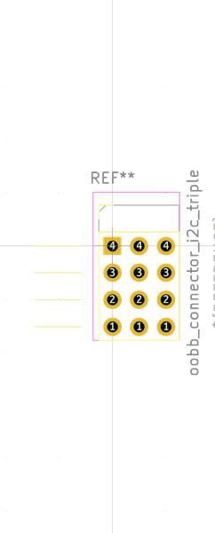
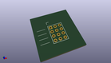
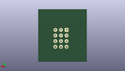
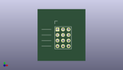

# OOMP Footprint  
## ESP32-DevKitC  by oomlout  
  
oomp key: oomp_oomlout_oomlout_oomp_part_footprints_bbdcmcue32_electronic_breakout_board_devkitc_mcu_espressif_esp32  
  
source repo at: [http://github.com/oomlout/oomlout_oomp_part_kicad_footprints/blob/master/tmp/data/oomlout_oomp_footprint_src/oomlout_oomp_part_footprints.pretty/xcr3213mhz8_electronic_ceramic_resonator_3213_3_pin_ground_pin_2_8_mega_hertz_1.kicad_mod](http://github.com/oomlout/oomlout_oomp_part_kicad_footprints/blob/master/tmp/data/oomlout_oomp_footprint_src/oomlout_oomp_part_footprints.pretty/xcr3213mhz8_electronic_ceramic_resonator_3213_3_pin_ground_pin_2_8_mega_hertz_1.kicad_mod)  
## Footprint  
  
  
  
  
| name | value | 
| --- | --- | 
| footprint name | ESP32-DevKitC | 
| footprint description | ESP32-DevKitC: https://docs.espressif.com/projects/esp-idf/en/latest/esp32/hw-reference/esp32/get-started-devkitc.html | 
| number of pads | 38 | 
| github path | http://github.com/oomlout/oomlout_oomp_part_kicad_footprints/blob/master/tmp/data/oomlout_oomp_footprint_src/oomlout_oomp_part_footprints.pretty/bbdcmcue32_electronic_breakout_board_devkitc_mcu_espressif_esp32.kicad_mod | 
| oomp key | oomp_oomlout_oomlout_oomp_part_footprints_bbdcmcue32_electronic_breakout_board_devkitc_mcu_espressif_esp32 | 
| oomp bot github | https://github.com/oomlout/oomlout_oomp_footprint_bot/tree/main/tmp/data/oomlout_oomp_footprint_src/footprints/oomlout_oomlout_oomp_part_footprints_bbdcmcue32_electronic_breakout_board_devkitc_mcu_espressif_esp32/working | 
## Images  
  
  
  
  
  
  
  
  
