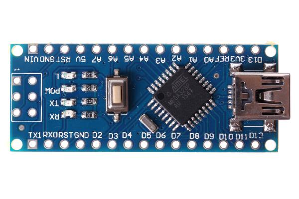
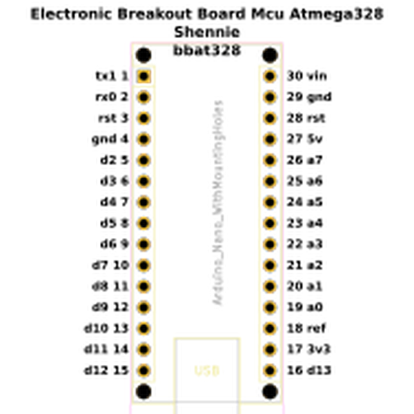
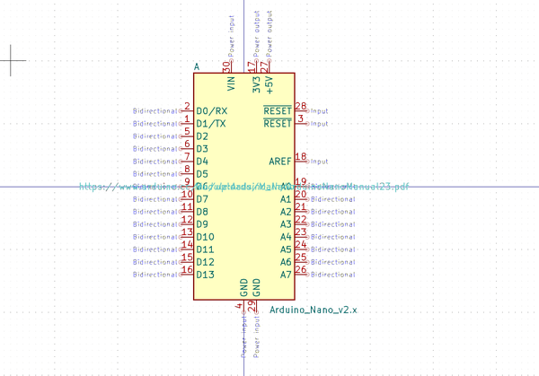
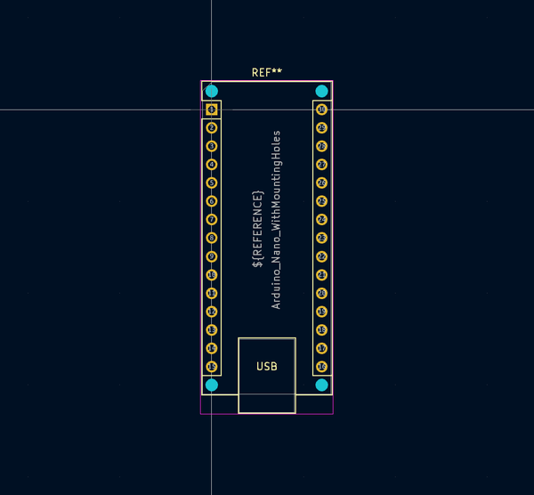

# Electronic Breakout Board Mcu Atmega328 Shennie
  

A popular arduino compatible atmega328 board from aliexpress  
* oomp_key: oomp_electronic_breakout_board_mcu_atmega328_shennie 
* short_code: bbat328
* md5_6: 09dfb7  
* github_link: https://github.com/oomlout/oomlout_oomp_part_src/tree/main/parts/electronic_breakout_board_mcu_atmega328_shennie/working  
## naming details
* classification -- electronic
* type -- breakout_board
* size -- 
* color -- mcu
* description_main -- atmega328
* description_extra -- shennie
* manucaturer -- 
* part_number -- 
## pinout
  
List of Pins:

* 1 : tx1
* 2 : rx0
* 3 : rst
* 4 : gnd
* 5 : d2
* 6 : d3
* 7 : d4
* 8 : d5
* 9 : d6
* 10 : d7
* 11 : d8
* 12 : d9
* 13 : d10
* 14 : d11
* 15 : d12
* 16 : d13
* 17 : 3v3
* 18 : ref
* 19 : a0
* 20 : a1
* 21 : a2
* 22 : a3
* 23 : a4
* 24 : a5
* 25 : a6
* 26 : a7
* 27 : 5v
* 28 : rst
* 29 : gnd
* 30 : vin

## symbol

  
oomp_key: oomp_kicad_mcu_module_arduino_nano_v2_x  
link: https://github.com/oomlout/oomlout_oomp_symbol_bot/tree/main/symbols/kicad_mcu_module_arduino_nano_v2_x/working  

## footprint

  
oomp_key: oomp_kicad_module_arduino_nano_withmountingholes  
link: https://github.com/oomlout/oomlout_oomp_footprint_bot/tree/main/footprints/kicad_module_arduino_nano_withmountingholes/working  

## full_summary
| name | value | 
| --- | --- | 
| name | value | 
| classification | electronic | 
| type | breakout_board | 
| size |  | 
| color | mcu | 
| description_main | atmega328 | 
| description_extra | shennie | 
| manufacturer |  | 
| part_number |  | 
| description | A popular arduino compatible atmega328 board from aliexpress | 
| short_name |  | 
| pins_pin_1_name | tx1 | 
| pins_pin_1_number | 1 | 
| pins_pin_1_type | signal | 
| pins_pin_2_name | rx0 | 
| pins_pin_2_number | 2 | 
| pins_pin_2_type | signal | 
| pins_pin_3_name | rst | 
| pins_pin_3_number | 3 | 
| pins_pin_3_type | signal | 
| pins_pin_4_name | gnd | 
| pins_pin_4_number | 4 | 
| pins_pin_4_type | power | 
| pins_pin_5_name | d2 | 
| pins_pin_5_number | 5 | 
| pins_pin_5_type | signal | 
| pins_pin_6_name | d3 | 
| pins_pin_6_number | 6 | 
| pins_pin_6_type | signal | 
| pins_pin_7_name | d4 | 
| pins_pin_7_number | 7 | 
| pins_pin_7_type | signal | 
| pins_pin_8_name | d5 | 
| pins_pin_8_number | 8 | 
| pins_pin_8_type | signal | 
| pins_pin_9_name | d6 | 
| pins_pin_9_number | 9 | 
| pins_pin_9_type | signal | 
| pins_pin_10_name | d7 | 
| pins_pin_10_number | 10 | 
| pins_pin_10_type | signal | 
| pins_pin_11_name | d8 | 
| pins_pin_11_number | 11 | 
| pins_pin_11_type | signal | 
| pins_pin_12_name | d9 | 
| pins_pin_12_number | 12 | 
| pins_pin_12_type | signal | 
| pins_pin_13_name | d10 | 
| pins_pin_13_number | 13 | 
| pins_pin_13_type | signal | 
| pins_pin_14_name | d11 | 
| pins_pin_14_number | 14 | 
| pins_pin_14_type | signal | 
| pins_pin_15_name | d12 | 
| pins_pin_15_number | 15 | 
| pins_pin_15_type | signal | 
| pins_pin_16_name | d13 | 
| pins_pin_16_number | 16 | 
| pins_pin_16_type | signal | 
| pins_pin_17_name | 3v3 | 
| pins_pin_17_number | 17 | 
| pins_pin_17_type | power | 
| pins_pin_18_name | ref | 
| pins_pin_18_number | 18 | 
| pins_pin_18_type | signal | 
| pins_pin_19_name | a0 | 
| pins_pin_19_number | 19 | 
| pins_pin_19_type | signal | 
| pins_pin_20_name | a1 | 
| pins_pin_20_number | 20 | 
| pins_pin_20_type | signal | 
| pins_pin_21_name | a2 | 
| pins_pin_21_number | 21 | 
| pins_pin_21_type | signal | 
| pins_pin_22_name | a3 | 
| pins_pin_22_number | 22 | 
| pins_pin_22_type | signal | 
| pins_pin_23_name | a4 | 
| pins_pin_23_number | 23 | 
| pins_pin_23_type | signal | 
| pins_pin_24_name | a5 | 
| pins_pin_24_number | 24 | 
| pins_pin_24_type | signal | 
| pins_pin_25_name | a6 | 
| pins_pin_25_number | 25 | 
| pins_pin_25_type | signal | 
| pins_pin_26_name | a7 | 
| pins_pin_26_number | 26 | 
| pins_pin_26_type | signal | 
| pins_pin_27_name | 5v | 
| pins_pin_27_number | 27 | 
| pins_pin_27_type | power | 
| pins_pin_28_name | rst | 
| pins_pin_28_number | 28 | 
| pins_pin_28_type | signal | 
| pins_pin_29_name | gnd | 
| pins_pin_29_number | 29 | 
| pins_pin_29_type | gnd | 
| pins_pin_30_name | vin | 
| pins_pin_30_number | 30 | 
| pins_pin_30_type | power | 
| kicad_reference | U | 
| notes | [] | 
| id | electronic_breakout_board_mcu_atmega328_shennie | 
| oomp_key | oomp_electronic_breakout_board_mcu_atmega328_shennie | 
| github_link | https://github.com/oomlout/oomlout_oomp_part_src/tree/main/parts/electronic_breakout_board_mcu_atmega328_shennie/working | 
| directory | parts/electronic_breakout_board_mcu_atmega328_shennie | 
| name | Electronic Breakout Board Mcu Atmega328 Shennie | 
| short_code | bbat328 | 
| distributors | [] | 
| manufacturers | [] | 
| md5 | 09dfb71639ea7f3aaca031501c5571c4 | 
| md5_5 | 09dfb | 
| md5_6 | 09dfb7 | 
| md5_10 | 09dfb71639 | 
| markdown_full | [electronic_breakout_board_mcu_atmega328_shennie](https://github.com/oomlout/oomlout_oomp_part_src/tree/main/parts/electronic_breakout_board_mcu_atmega328_shennie/working) [bbat328](https://github.com/oomlout/oomlout_oomp_part_src/tree/main/parts/electronic_breakout_board_mcu_atmega328_shennie/working)   | 
| footprint | [{'link': 'https://github.com/oomlout/oomlout_oomp_footprint_bot/tree/main/foootprntss/kicad_module_arduino_nano_withmountingholes', 'oomp_key': 'oomp_kicad_module_arduino_nano_withmountingholes', 'directory': 'oomlout_oomp_footprint_bot/footprints/kicad_module_arduino_nano_withmountingholes//working/working.kicad_mod'}] | 
| symbol | [{'link': 'https://github.com/oomlout/oomlout_oomp_symbol_bot/tree/main/symbols/kicad_mcu_module_arduino_nano_v2_x', 'oomp_key': 'oomp_kicad_mcu_module_arduino_nano_v2_x', 'directory': 'oomlout_oomp_symbol_bot/symbols/kicad_mcu_module_arduino_nano_v2_x//working/working.kicad_sym'}] | 
