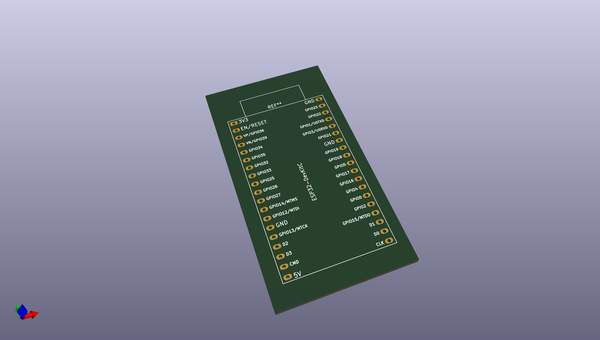
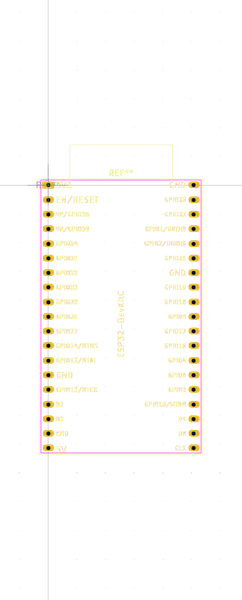

# OOMP Footprint  
## RaspberryPiPico_SMD_TH  by oomlout  
  
oomp key: oomp_oomlout_oomlout_oomp_part_footprints_bbpcmcurp2040_electronic_breakout_board_pico_mcu_raspberry_pi_2040  
  
source repo at: [http://github.com/oomlout/oomlout_oomp_part_kicad_footprints/blob/master/tmp/data/oomlout_oomp_footprint_src/oomlout_oomp_part_footprints.pretty/xcr3213mhz8_electronic_ceramic_resonator_3213_3_pin_ground_pin_2_8_mega_hertz_1.kicad_mod](http://github.com/oomlout/oomlout_oomp_part_kicad_footprints/blob/master/tmp/data/oomlout_oomp_footprint_src/oomlout_oomp_part_footprints.pretty/xcr3213mhz8_electronic_ceramic_resonator_3213_3_pin_ground_pin_2_8_mega_hertz_1.kicad_mod)  
## Footprint  
  
  
  
  
| name | value | 
| --- | --- | 
| footprint name | RaspberryPiPico_SMD_TH | 
| footprint description | Through hole straight pin header, 2x20, 2.54mm pitch, double rows | 
| number of pads | 96 | 
| github path | http://github.com/oomlout/oomlout_oomp_part_kicad_footprints/blob/master/tmp/data/oomlout_oomp_footprint_src/oomlout_oomp_part_footprints.pretty/bbpcmcurp2040_electronic_breakout_board_pico_mcu_raspberry_pi_2040.kicad_mod | 
| oomp key | oomp_oomlout_oomlout_oomp_part_footprints_bbpcmcurp2040_electronic_breakout_board_pico_mcu_raspberry_pi_2040 | 
| oomp bot github | https://github.com/oomlout/oomlout_oomp_footprint_bot/tree/main/tmp/data/oomlout_oomp_footprint_src/footprints/oomlout_oomlout_oomp_part_footprints_bbpcmcurp2040_electronic_breakout_board_pico_mcu_raspberry_pi_2040/working | 
## Images  
