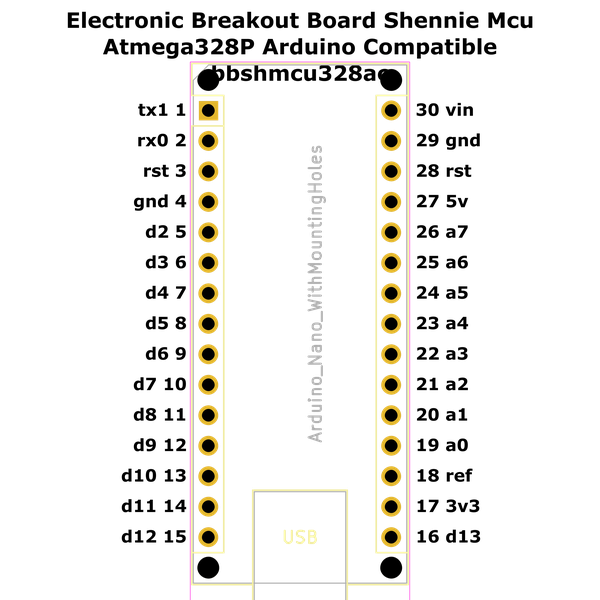

# Electronic Breakout Board Shennie Mcu Atmega328P Arduino Compatible

A popular arduino compatible atmega328 board from aliexpress  
* oomp_key: oomp_electronic_breakout_board_shennie_mcu_atmega328p_arduino_compatible 
* short_code: bbshmcu328ac
* md5_6: a5af1f  
* github_link: https://github.com/oomlout/oomlout_oomp_part_src/tree/main/parts/electronic_breakout_board_shennie_mcu_atmega328p_arduino_compatible/working  
## naming details
* classification -- electronic
* type -- breakout_board
* size -- shennie
* color -- mcu
* description_main -- atmega328p
* description_extra -- arduino_compatible
* manucaturer -- 
* part_number -- 
## pinout
  
List of Pins:

* 1 : tx1
* 2 : rx0
* 3 : rst
* 4 : gnd
* 5 : d2
* 6 : d3
* 7 : d4
* 8 : d5
* 9 : d6
* 10 : d7
* 11 : d8
* 12 : d9
* 13 : d10
* 14 : d11
* 15 : d12
* 16 : d13
* 17 : 3v3
* 18 : ref
* 19 : a0
* 20 : a1
* 21 : a2
* 22 : a3
* 23 : a4
* 24 : a5
* 25 : a6
* 26 : a7
* 27 : 5v
* 28 : rst
* 29 : gnd
* 30 : vin

## symbol

  
oomp_key: oomp_kicad_mcu_module_arduino_nano_v2_x  
link: https://github.com/oomlout/oomlout_oomp_symbol_bot/tree/main/symbols/kicad_mcu_module_arduino_nano_v2_x/working  

## footprint

  
oomp_key: oomp_kicad_module_arduino_nano_withmountingholes  
link: https://github.com/oomlout/oomlout_oomp_footprint_bot/tree/main/footprints/kicad_module_arduino_nano_withmountingholes/working  

  
oomp_key: oomp_oomlout_oomlout_oomp_part_footprints_bbshmcu328ac_electronic_breakout_board_shennie_mcu_atmega328p_arduino_compatible  
link: https://github.com/oomlout/oomlout_oomp_footprint_bot/tree/main/footprints/oomlout_oomlout_oomp_part_footprints_bbshmcu328ac_electronic_breakout_board_shennie_mcu_atmega328p_arduino_compatible/working  

## full_summary
| name | value | 
| --- | --- | 
| name | value | 
| classification | electronic | 
| type | breakout_board | 
| size | shennie | 
| color | mcu | 
| description_main | atmega328p | 
| description_extra | arduino_compatible | 
| manufacturer |  | 
| part_number |  | 
| description | A popular arduino compatible atmega328 board from aliexpress | 
| short_name |  | 
| pins_pin_1_name | tx1 | 
| pins_pin_1_number | 1 | 
| pins_pin_1_type | signal | 
| pins_pin_2_name | rx0 | 
| pins_pin_2_number | 2 | 
| pins_pin_2_type | signal | 
| pins_pin_3_name | rst | 
| pins_pin_3_number | 3 | 
| pins_pin_3_type | signal | 
| pins_pin_4_name | gnd | 
| pins_pin_4_number | 4 | 
| pins_pin_4_type | power | 
| pins_pin_5_name | d2 | 
| pins_pin_5_number | 5 | 
| pins_pin_5_type | signal | 
| pins_pin_6_name | d3 | 
| pins_pin_6_number | 6 | 
| pins_pin_6_type | signal | 
| pins_pin_7_name | d4 | 
| pins_pin_7_number | 7 | 
| pins_pin_7_type | signal | 
| pins_pin_8_name | d5 | 
| pins_pin_8_number | 8 | 
| pins_pin_8_type | signal | 
| pins_pin_9_name | d6 | 
| pins_pin_9_number | 9 | 
| pins_pin_9_type | signal | 
| pins_pin_10_name | d7 | 
| pins_pin_10_number | 10 | 
| pins_pin_10_type | signal | 
| pins_pin_11_name | d8 | 
| pins_pin_11_number | 11 | 
| pins_pin_11_type | signal | 
| pins_pin_12_name | d9 | 
| pins_pin_12_number | 12 | 
| pins_pin_12_type | signal | 
| pins_pin_13_name | d10 | 
| pins_pin_13_number | 13 | 
| pins_pin_13_type | signal | 
| pins_pin_14_name | d11 | 
| pins_pin_14_number | 14 | 
| pins_pin_14_type | signal | 
| pins_pin_15_name | d12 | 
| pins_pin_15_number | 15 | 
| pins_pin_15_type | signal | 
| pins_pin_16_name | d13 | 
| pins_pin_16_number | 16 | 
| pins_pin_16_type | signal | 
| pins_pin_17_name | 3v3 | 
| pins_pin_17_number | 17 | 
| pins_pin_17_type | power | 
| pins_pin_18_name | ref | 
| pins_pin_18_number | 18 | 
| pins_pin_18_type | signal | 
| pins_pin_19_name | a0 | 
| pins_pin_19_number | 19 | 
| pins_pin_19_type | signal | 
| pins_pin_20_name | a1 | 
| pins_pin_20_number | 20 | 
| pins_pin_20_type | signal | 
| pins_pin_21_name | a2 | 
| pins_pin_21_number | 21 | 
| pins_pin_21_type | signal | 
| pins_pin_22_name | a3 | 
| pins_pin_22_number | 22 | 
| pins_pin_22_type | signal | 
| pins_pin_23_name | a4 | 
| pins_pin_23_number | 23 | 
| pins_pin_23_type | signal | 
| pins_pin_24_name | a5 | 
| pins_pin_24_number | 24 | 
| pins_pin_24_type | signal | 
| pins_pin_25_name | a6 | 
| pins_pin_25_number | 25 | 
| pins_pin_25_type | signal | 
| pins_pin_26_name | a7 | 
| pins_pin_26_number | 26 | 
| pins_pin_26_type | signal | 
| pins_pin_27_name | 5v | 
| pins_pin_27_number | 27 | 
| pins_pin_27_type | power | 
| pins_pin_28_name | rst | 
| pins_pin_28_number | 28 | 
| pins_pin_28_type | signal | 
| pins_pin_29_name | gnd | 
| pins_pin_29_number | 29 | 
| pins_pin_29_type | gnd | 
| pins_pin_30_name | vin | 
| pins_pin_30_number | 30 | 
| pins_pin_30_type | power | 
| kicad_reference | BB | 
| notes | [ ] | 
| classification_upper | ELECTRONIC | 
| classification_capital | Electronic | 
| classification_first_letter | e | 
| classification_first_letter_upper | E | 
| type_upper | BREAKOUT_BOARD | 
| type_capital | Breakout Board | 
| type_first_letter | b | 
| type_first_letter_upper | B | 
| size_upper | SHENNIE | 
| size_capital | Shennie | 
| size_first_letter | s | 
| size_first_letter_upper | S | 
| color_upper | MCU | 
| color_capital | Mcu | 
| color_first_letter | m | 
| color_first_letter_upper | M | 
| description_main_upper | ATMEGA328P | 
| description_main_capital | Atmega328P | 
| description_main_first_letter | a | 
| description_main_first_letter_upper | A | 
| description_extra_upper | ARDUINO_COMPATIBLE | 
| description_extra_capital | Arduino Compatible | 
| description_extra_first_letter | a | 
| description_extra_first_letter_upper | A | 
| manufacturer_upper |  | 
| manufacturer_capital |  | 
| manufacturer_first_letter |  | 
| manufacturer_first_letter_upper |  | 
| part_number_upper |  | 
| part_number_capital |  | 
| part_number_first_letter |  | 
| part_number_first_letter_upper |  | 
| id | electronic_breakout_board_shennie_mcu_atmega328p_arduino_compatible | 
| id_no_class | breakout_board_shennie_mcu_atmega328p_arduino_compatible | 
| id_no_type | shennie_mcu_atmega328p_arduino_compatible | 
| id_no_size | mcu_atmega328p_arduino_compatible | 
| oomp_key | oomp_electronic_breakout_board_shennie_mcu_atmega328p_arduino_compatible | 
| github_link | https://github.com/oomlout/oomlout_oomp_part_src/tree/main/parts/electronic_breakout_board_shennie_mcu_atmega328p_arduino_compatible/working | 
| directory | parts/electronic_breakout_board_shennie_mcu_atmega328p_arduino_compatible | 
| name | Electronic Breakout Board Shennie Mcu Atmega328P Arduino Compatible | 
| name_no_class | Breakout Board Shennie Mcu Atmega328P Arduino Compatible | 
| name_no_type | Shennie Mcu Atmega328P Arduino Compatible | 
| name_no_size | Mcu Atmega328P Arduino Compatible | 
| short_code | bbshmcu328ac | 
| short_code_upper | BBSHMCU328AC | 
| distributors | [ ] | 
| manufacturers | [ ] | 
| md5 | a5af1f0cbe5a1054334e42dd5ece231c | 
| md5_5 | a5af1 | 
| md5_5_upper | A5AF1 | 
| md5_6 | a5af1f | 
| md5_6_upper | A5AF1F | 
| md5_6_alpha | 6gqan | 
| md5_6_alpha_upper | 6GQAN | 
| md5_10 | a5af1f0cbe | 
| md5_10_upper | A5AF1F0CBE | 
| size_only_numbers |  | 
| size_only_numbers_no_zeros |  | 
| description_only_numbers | 328 | 
| description_only_numbers_short | 328 | 
| name_no_size_short | Mcu Atmega328P Arduino Compatible | 
| description_or_color | M328 | 
| description_or_color_upper | M328 | 
| markdown_full | [electronic_breakout_board_shennie_mcu_atmega328p_arduino_compatible](https://github.com/oomlout/oomlout_oomp_part_src/tree/main/parts/electronic_breakout_board_shennie_mcu_atmega328p_arduino_compatible/working) [bbshmcu328ac](https://github.com/oomlout/oomlout_oomp_part_src/tree/main/parts/electronic_breakout_board_shennie_mcu_atmega328p_arduino_compatible/working) [Electronic Breakout Board Shennie Mcu Atmega328P Arduino Compatible](https://github.com/oomlout/oomlout_oomp_part_src/tree/main/parts/electronic_breakout_board_shennie_mcu_atmega328p_arduino_compatible/working)   | 
| markdown_short | [electronic_breakout_board_shennie_mcu_atmega328p_arduino_compatible](https://github.com/oomlout/oomlout_oomp_part_src/tree/main/parts/electronic_breakout_board_shennie_mcu_atmega328p_arduino_compatible/working)   | 
| footprint | [ { ' l i n k ' :   ' h t t p s : / / g i t h u b . c o m / o o m l o u t / o o m l o u t _ o o m p _ f o o t p r i n t _ b o t / t r e e / m a i n / f o o o t p r n t s s / k i c a d _ m o d u l e _ a r d u i n o _ n a n o _ w i t h m o u n t i n g h o l e s ' ,   ' o o m p _ k e y ' :   ' o o m p _ k i c a d _ m o d u l e _ a r d u i n o _ n a n o _ w i t h m o u n t i n g h o l e s ' ,   ' d i r e c t o r y ' :   ' o o m l o u t _ o o m p _ f o o t p r i n t _ b o t / f o o t p r i n t s / k i c a d _ m o d u l e _ a r d u i n o _ n a n o _ w i t h m o u n t i n g h o l e s / / w o r k i n g / w o r k i n g . k i c a d _ m o d ' ,   ' n o t e ' :   ' s o u r c e   f o o t p r i n t   k i c a d _ m o d u l e _ a r d u i n o _ n a n o _ w i t h m o u n t i n g h o l e s ' ,   ' i n d e x ' :   0 } ,   { ' l i n k ' :   ' h t t p s : / / g i t h u b . c o m / o o m l o u t / o o m l o u t _ o o m p _ f o o t p r i n t _ b o t / t r e e / m a i n / f o o o t p r n t s s / o o m l o u t _ o o m l o u t _ o o m p _ p a r t _ f o o t p r i n t s _ b b s h m c u 3 2 8 a c _ e l e c t r o n i c _ b r e a k o u t _ b o a r d _ s h e n n i e _ m c u _ a t m e g a 3 2 8 p _ a r d u i n o _ c o m p a t i b l e ' ,   ' o o m p _ k e y ' :   ' o o m p _ o o m l o u t _ o o m l o u t _ o o m p _ p a r t _ f o o t p r i n t s _ b b s h m c u 3 2 8 a c _ e l e c t r o n i c _ b r e a k o u t _ b o a r d _ s h e n n i e _ m c u _ a t m e g a 3 2 8 p _ a r d u i n o _ c o m p a t i b l e ' ,   ' d i r e c t o r y ' :   ' o o m l o u t _ o o m p _ f o o t p r i n t _ b o t / f o o t p r i n t s / o o m l o u t _ o o m l o u t _ o o m p _ p a r t _ f o o t p r i n t s _ b b s h m c u 3 2 8 a c _ e l e c t r o n i c _ b r e a k o u t _ b o a r d _ s h e n n i e _ m c u _ a t m e g a 3 2 8 p _ a r d u i n o _ c o m p a t i b l e / / w o r k i n g / w o r k i n g . k i c a d _ m o d ' ,   ' n o t e ' :   ' o o m p   g e n e r a t e d   f o o t p r i n t ' ,   ' i n d e x ' :   1 } ] | 
| symbol | [ { ' l i n k ' :   ' h t t p s : / / g i t h u b . c o m / o o m l o u t / o o m l o u t _ o o m p _ s y m b o l _ b o t / t r e e / m a i n / s y m b o l s / k i c a d _ m c u _ m o d u l e _ a r d u i n o _ n a n o _ v 2 _ x ' ,   ' o o m p _ k e y ' :   ' o o m p _ k i c a d _ m c u _ m o d u l e _ a r d u i n o _ n a n o _ v 2 _ x ' ,   ' d i r e c t o r y ' :   ' o o m l o u t _ o o m p _ s y m b o l _ b o t / s y m b o l s / k i c a d _ m c u _ m o d u l e _ a r d u i n o _ n a n o _ v 2 _ x / / w o r k i n g / w o r k i n g . k i c a d _ s y m ' ,   ' i n d e x ' :   0 } ] | 
