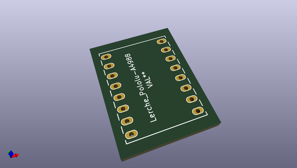

# OOMP Footprint  
## Lerche_Pololu-A4988  by ChristianLerche  
  
oomp key: oomp_christianlerche_lerchetech_lerche_pololu_a4988  
  
source repo at: [http://github.com/ChristianLerche/LercheTech_KiCAD/blob/master/tmp/data/oomlout_oomp_footprint_src/LercheTech.pretty/WQFN_40_EP.kicad_mod](http://github.com/ChristianLerche/LercheTech_KiCAD/blob/master/tmp/data/oomlout_oomp_footprint_src/LercheTech.pretty/WQFN_40_EP.kicad_mod)  
## Footprint  
  
  
  
  
| name | value | 
| --- | --- | 
| footprint name | Lerche_Pololu-A4988 | 
| footprint description | None | 
| number of pads | 16 | 
| github path | http://github.com/ChristianLerche/LercheTech_KiCAD/blob/master/tmp/data/oomlout_oomp_footprint_src/LercheTech.pretty/Lerche_Pololu-A4988.kicad_mod | 
| oomp key | oomp_christianlerche_lerchetech_lerche_pololu_a4988 | 
| oomp bot github | https://github.com/oomlout/oomlout_oomp_footprint_bot/tree/main/tmp/data/oomlout_oomp_footprint_src/footprints/christianlerche_lerchetech_lerche_pololu_a4988/working | 
## Images  
