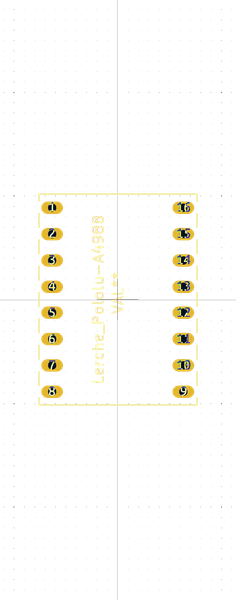

# Electronic Breakout Board Step Stick Motor Driver Stepper Motor

A common breakout format for a stepper motor driver  
* oomp_key: oomp_electronic_breakout_board_step_stick_motor_driver_stepper_motor 
* short_code: bbmdsm
* md5_6: 6c94da  
* github_link: https://github.com/oomlout/oomlout_oomp_part_src/tree/main/parts/electronic_breakout_board_step_stick_motor_driver_stepper_motor/working  
## naming details
* classification -- electronic
* type -- breakout_board
* size -- step_stick
* color -- motor_driver
* description_main -- stepper_motor
* description_extra -- 
* manucaturer -- 
* part_number -- 
## pinout
  
List of Pins:

* 1 : en
* 2 : ms1
* 3 : ms2
* 4 : ms3
* 5 : rst
* 6 : slp
* 7 : step
* 8 : dir
* 9 : gnd
* 10 : vdd
* 11 : 1b
* 12 : 1a
* 13 : 2a
* 14 : 2b
* 15 : gnd
* 16 : vmot

## footprint

  
oomp_key: oomp_christianlerche_lerchetech_lerche_pololu_a4988  
link: https://github.com/oomlout/oomlout_oomp_footprint_bot/tree/main/footprints/christianlerche_lerchetech_lerche_pololu_a4988/working  

## full_summary
| name | value | 
| --- | --- | 
| name | value | 
| classification | electronic | 
| type | breakout_board | 
| size | step_stick | 
| color | motor_driver | 
| description_main | stepper_motor | 
| description_extra |  | 
| manufacturer |  | 
| part_number |  | 
| description | A common breakout format for a stepper motor driver | 
| short_name |  | 
| pins_pin_1_name | en | 
| pins_pin_1_number | 1 | 
| pins_pin_1_type | signal | 
| pins_pin_2_name | ms1 | 
| pins_pin_2_number | 2 | 
| pins_pin_2_type | signal | 
| pins_pin_3_name | ms2 | 
| pins_pin_3_number | 3 | 
| pins_pin_3_type | signal | 
| pins_pin_4_name | ms3 | 
| pins_pin_4_number | 4 | 
| pins_pin_4_type | power | 
| pins_pin_5_name | rst | 
| pins_pin_5_number | 5 | 
| pins_pin_5_type | signal | 
| pins_pin_6_name | slp | 
| pins_pin_6_number | 6 | 
| pins_pin_6_type | signal | 
| pins_pin_7_name | step | 
| pins_pin_7_number | 7 | 
| pins_pin_7_type | signal | 
| pins_pin_8_name | dir | 
| pins_pin_8_number | 8 | 
| pins_pin_8_type | signal | 
| pins_pin_9_name | gnd | 
| pins_pin_9_number | 9 | 
| pins_pin_9_type | signal | 
| pins_pin_10_name | vdd | 
| pins_pin_10_number | 10 | 
| pins_pin_10_type | signal | 
| pins_pin_11_name | 1b | 
| pins_pin_11_number | 11 | 
| pins_pin_11_type | signal | 
| pins_pin_12_name | 1a | 
| pins_pin_12_number | 12 | 
| pins_pin_12_type | signal | 
| pins_pin_13_name | 2a | 
| pins_pin_13_number | 13 | 
| pins_pin_13_type | signal | 
| pins_pin_14_name | 2b | 
| pins_pin_14_number | 14 | 
| pins_pin_14_type | signal | 
| pins_pin_15_name | gnd | 
| pins_pin_15_number | 15 | 
| pins_pin_15_type | signal | 
| pins_pin_16_name | vmot | 
| pins_pin_16_number | 16 | 
| pins_pin_16_type | signal | 
| kicad_reference | IC | 
| notes | [] | 
| id | electronic_breakout_board_step_stick_motor_driver_stepper_motor | 
| id_no_class | breakout_board_step_stick_motor_driver_stepper_motor | 
| id_no_type | step_stick_motor_driver_stepper_motor | 
| oomp_key | oomp_electronic_breakout_board_step_stick_motor_driver_stepper_motor | 
| github_link | https://github.com/oomlout/oomlout_oomp_part_src/tree/main/parts/electronic_breakout_board_step_stick_motor_driver_stepper_motor/working | 
| directory | parts/electronic_breakout_board_step_stick_motor_driver_stepper_motor | 
| name | Electronic Breakout Board Step Stick Motor Driver Stepper Motor | 
| short_code | bbmdsm | 
| short_code_upper | BBMDSM | 
| distributors | [] | 
| manufacturers | [] | 
| md5 | 6c94dab5276260f88ab0eabadd66118c | 
| md5_5 | 6c94d | 
| md5_5_upper | 6C94D | 
| md5_6 | 6c94da | 
| md5_6_upper | 6C94DA | 
| md5_10 | 6c94dab527 | 
| md5_10_upper | 6C94DAB527 | 
| type_first_letter | b | 
| type_first_letter_upper | B | 
| size_only_numbers |  | 
| size_only_numbers_no_zeros |  | 
| color_upper | MOTOR_DRIVER | 
| color_first_letter | m | 
| color_first_letter_upper | M | 
| description_only_numbers |  | 
| description_only_numbers_short |   | 
| description_or_color | m  | 
| description_or_color_upper | M  | 
| markdown_full | [electronic_breakout_board_step_stick_motor_driver_stepper_motor](https://github.com/oomlout/oomlout_oomp_part_src/tree/main/parts/electronic_breakout_board_step_stick_motor_driver_stepper_motor/working) [bbmdsm](https://github.com/oomlout/oomlout_oomp_part_src/tree/main/parts/electronic_breakout_board_step_stick_motor_driver_stepper_motor/working) [Electronic Breakout Board Step Stick Motor Driver Stepper Motor](https://github.com/oomlout/oomlout_oomp_part_src/tree/main/parts/electronic_breakout_board_step_stick_motor_driver_stepper_motor/working)   | 
| markdown_short | [electronic_breakout_board_step_stick_motor_driver_stepper_motor](https://github.com/oomlout/oomlout_oomp_part_src/tree/main/parts/electronic_breakout_board_step_stick_motor_driver_stepper_motor/working)   | 
| footprint | [{'link': 'https://github.com/oomlout/oomlout_oomp_footprint_bot/tree/main/foootprntss/christianlerche_lerchetech_lerche_pololu_a4988', 'oomp_key': 'oomp_christianlerche_lerchetech_lerche_pololu_a4988', 'directory': 'oomlout_oomp_footprint_bot/footprints/christianlerche_lerchetech_lerche_pololu_a4988//working/working.kicad_mod'}] | 
