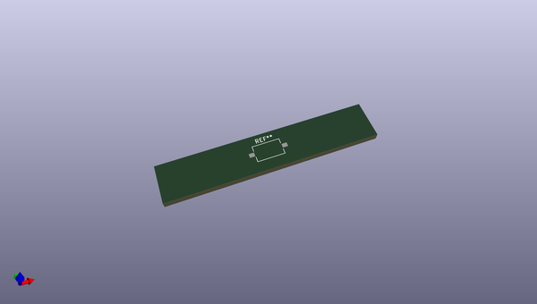

# OOMP Footprint  
## SW_Tactile_SPST_NO_Straight_CK_PTS636Sx25SMTRLFS  by none  
  
oomp key: oomp_kicad_button_switch_smd_sw_tactile_spst_no_straight_ck_pts636sx25smtrlfs  
  
source repo at: [http://gitlab.com/kicad/libraries/kicad-footprints//blob/master/tmp/libraries/kicad-footprints/Varistor.pretty/RV_Rect_V25S440P_L26.5mm_W8.2mm_P12.7mm.kicad_mod](http://gitlab.com/kicad/libraries/kicad-footprints//blob/master/tmp/libraries/kicad-footprints/Varistor.pretty/RV_Rect_V25S440P_L26.5mm_W8.2mm_P12.7mm.kicad_mod)  
## Footprint  
  
  
  
  
| name | value | 
| --- | --- | 
| footprint name | SW_Tactile_SPST_NO_Straight_CK_PTS636Sx25SMTRLFS | 
| footprint description | Tactile switch, SPST, 6.0x3.5 mm, H2.5 mm, straight, NO, gull wing leads: https://www.ckswitches.com/media/2779/pts636.pdf | 
| number of pads | 2 | 
| github path | http://github.com/kicad/libraries/kicad-footprints//blob/master/tmp/libraries/kicad-footprints/Button_Switch_SMD.pretty/SW_Tactile_SPST_NO_Straight_CK_PTS636Sx25SMTRLFS.kicad_mod | 
| oomp key | oomp_kicad_button_switch_smd_sw_tactile_spst_no_straight_ck_pts636sx25smtrlfs | 
| oomp bot github | https://github.com/oomlout/oomlout_oomp_footprint_bot/tree/main/footprints/kicad_button_switch_smd_sw_tactile_spst_no_straight_ck_pts636sx25smtrlfs/working | 
## Images  
