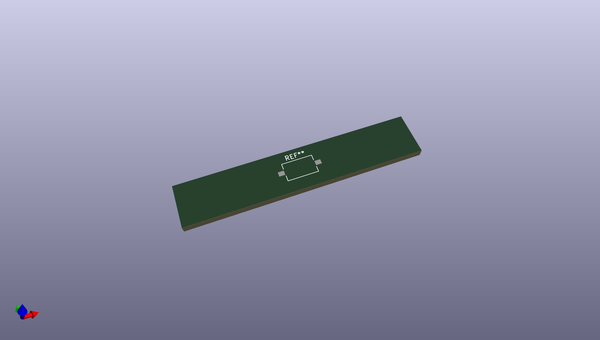
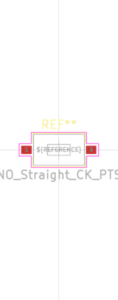
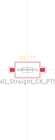
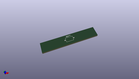

# OOMP Footprint  
## SW_Tactile_SPST_NO_Straight_CK_PTS636Sx25SMTRLFS  by oomlout  
  
oomp key: oomp_oomlout_oomlout_oomp_part_footprints_b3560s_electronic_button_3_5_mm_x_6_mm_x_2_5_mm_surface_mount  
  
source repo at: [http://github.com/oomlout/oomlout_oomp_part_kicad_footprints/blob/master/tmp/data/oomlout_oomp_footprint_src/oomlout_oomp_part_footprints.pretty/xcr3213mhz8_electronic_ceramic_resonator_3213_3_pin_ground_pin_2_8_mega_hertz_1.kicad_mod](http://github.com/oomlout/oomlout_oomp_part_kicad_footprints/blob/master/tmp/data/oomlout_oomp_footprint_src/oomlout_oomp_part_footprints.pretty/xcr3213mhz8_electronic_ceramic_resonator_3213_3_pin_ground_pin_2_8_mega_hertz_1.kicad_mod)  
## Footprint  
  
  
  
  
| name | value | 
| --- | --- | 
| footprint name | SW_Tactile_SPST_NO_Straight_CK_PTS636Sx25SMTRLFS | 
| footprint description | Tactile switch, SPST, 6.0x3.5 mm, H2.5 mm, straight, NO, gull wing leads: https://www.ckswitches.com/media/2779/pts636.pdf | 
| number of pads | 2 | 
| github path | http://github.com/oomlout/oomlout_oomp_part_kicad_footprints/blob/master/tmp/data/oomlout_oomp_footprint_src/oomlout_oomp_part_footprints.pretty/b3560s_electronic_button_3_5_mm_x_6_mm_x_2_5_mm_surface_mount.kicad_mod | 
| oomp key | oomp_oomlout_oomlout_oomp_part_footprints_b3560s_electronic_button_3_5_mm_x_6_mm_x_2_5_mm_surface_mount | 
| oomp bot github | https://github.com/oomlout/oomlout_oomp_footprint_bot/tree/main/tmp/data/oomlout_oomp_footprint_src/footprints/oomlout_oomlout_oomp_part_footprints_b3560s_electronic_button_3_5_mm_x_6_mm_x_2_5_mm_surface_mount/working | 
## Images  
  
  
  
  
  
  
  
  
