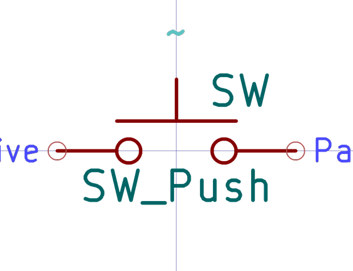

# Electronic Button 3 5 Mm X 6 Mm X 2 5 Mm Surface Mount
oomp_key: oomp_electronic_button_3_5_mm_x_6_mm_x_2_5_mm_surface_mount  

short_code: b3560s
## naming details
* classification -- electronic
* type -- button
* size -- 3_5_mm_x_6_mm_x_2_5_mm
* color -- surface_mount
* description_main -- 
* description_extra -- 
* manucaturer -- 
* part_number -- 
## pinout

List of Pins:

## symbol

oomp_key: oomp_kicad_switch_sw_push
link: https://github.com/oomlout/oomlout_oomp_symbol_bot/tree/main/symbols/kicad_switch_sw_push

## footprint

oomp_key: oomp_kicad_button_switch_smd_sw_tactile_spst_no_straight_ck_pts636sx25smtrlfs
link: https://github.com/oomlout/oomlout_oomp_footprint_bot/tree/main/foootprntss/kicad_button_switch_smd_sw_tactile_spst_no_straight_ck_pts636sx25smtrlfs
