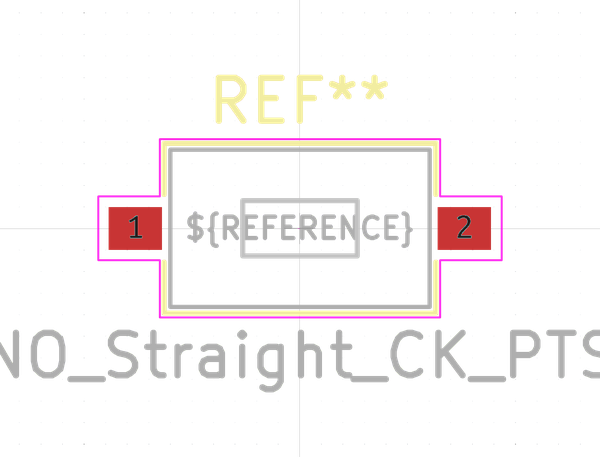

# Electronic Button 3 5 Mm X 6 Mm X 2 5 Mm Surface Mount
  

  
* oomp_key: oomp_electronic_button_3_5_mm_x_6_mm_x_2_5_mm_surface_mount 
* short_code: b3560s
* md5_6: daac53  
* github_link: https://github.com/oomlout/oomlout_oomp_part_src/tree/main/parts/electronic_button_3_5_mm_x_6_mm_x_2_5_mm_surface_mount/working  
## naming details
* classification -- electronic
* type -- button
* size -- 3_5_mm_x_6_mm_x_2_5_mm
* color -- surface_mount
* description_main -- 
* description_extra -- 
* manucaturer -- 
* part_number -- 

## distributors
* [LCSC - C2845294](https://lcsc.com/product-detail/C2845294.html)   

## symbol

  
oomp_key: oomp_kicad_switch_sw_push  
link: https://github.com/oomlout/oomlout_oomp_symbol_bot/tree/main/symbols/kicad_switch_sw_push/working  

## footprint

  
oomp_key: oomp_kicad_button_switch_smd_sw_tactile_spst_no_straight_ck_pts636sx25smtrlfs  
link: https://github.com/oomlout/oomlout_oomp_footprint_bot/tree/main/footprints/kicad_button_switch_smd_sw_tactile_spst_no_straight_ck_pts636sx25smtrlfs/working  

## full_summary
| name | value | 
| --- | --- | 
| name | value | 
| classification | electronic | 
| type | button | 
| size | 3_5_mm_x_6_mm_x_2_5_mm | 
| color | surface_mount | 
| description_main |  | 
| description_extra |  | 
| manufacturer |  | 
| part_number |  | 
| short_name |  | 
| distributors | [{'name': 'LCSC', 'part_number': 'C2845294', 'link': 'https://lcsc.com/product-detail/C2845294.html', 'id': 'distributor_lcsc'}] | 
| id | electronic_button_3_5_mm_x_6_mm_x_2_5_mm_surface_mount | 
| id_no_class | button_3_5_mm_x_6_mm_x_2_5_mm_surface_mount | 
| id_no_type | 3_5_mm_x_6_mm_x_2_5_mm_surface_mount | 
| oomp_key | oomp_electronic_button_3_5_mm_x_6_mm_x_2_5_mm_surface_mount | 
| github_link | https://github.com/oomlout/oomlout_oomp_part_src/tree/main/parts/electronic_button_3_5_mm_x_6_mm_x_2_5_mm_surface_mount/working | 
| directory | parts/electronic_button_3_5_mm_x_6_mm_x_2_5_mm_surface_mount | 
| name | Electronic Button 3 5 Mm X 6 Mm X 2 5 Mm Surface Mount | 
| short_code | b3560s | 
| short_code_upper | B3560S | 
| manufacturers | [] | 
| md5 | daac5353b33e60c79876e2262b80147e | 
| md5_5 | daac5 | 
| md5_5_upper | DAAC5 | 
| md5_6 | daac53 | 
| md5_6_upper | DAAC53 | 
| md5_10 | daac5353b3 | 
| md5_10_upper | DAAC5353B3 | 
| type_first_letter | b | 
| type_first_letter_upper | B | 
| size_only_numbers | 35625 | 
| size_only_numbers_no_zeros | 35625 | 
| color_upper | SURFACE_MOUNT | 
| color_first_letter | s | 
| color_first_letter_upper | S | 
| description_only_numbers |  | 
| description_only_numbers_short |   | 
| description_or_color | s  | 
| description_or_color_upper | S  | 
| markdown_full | [electronic_button_3_5_mm_x_6_mm_x_2_5_mm_surface_mount](https://github.com/oomlout/oomlout_oomp_part_src/tree/main/parts/electronic_button_3_5_mm_x_6_mm_x_2_5_mm_surface_mount/working) [b3560s](https://github.com/oomlout/oomlout_oomp_part_src/tree/main/parts/electronic_button_3_5_mm_x_6_mm_x_2_5_mm_surface_mount/working) [Electronic Button 3 5 Mm X 6 Mm X 2 5 Mm Surface Mount](https://github.com/oomlout/oomlout_oomp_part_src/tree/main/parts/electronic_button_3_5_mm_x_6_mm_x_2_5_mm_surface_mount/working) [LCSC - C2845294 ](https://lcsc.com/product-detail/C2845294.html)  | 
| markdown_short | [electronic_button_3_5_mm_x_6_mm_x_2_5_mm_surface_mount](https://github.com/oomlout/oomlout_oomp_part_src/tree/main/parts/electronic_button_3_5_mm_x_6_mm_x_2_5_mm_surface_mount/working) [LCSC - C2845294 ](https://lcsc.com/product-detail/C2845294.html)  | 
| footprint | [{'link': 'https://github.com/oomlout/oomlout_oomp_footprint_bot/tree/main/foootprntss/kicad_button_switch_smd_sw_tactile_spst_no_straight_ck_pts636sx25smtrlfs', 'oomp_key': 'oomp_kicad_button_switch_smd_sw_tactile_spst_no_straight_ck_pts636sx25smtrlfs', 'directory': 'oomlout_oomp_footprint_bot/footprints/kicad_button_switch_smd_sw_tactile_spst_no_straight_ck_pts636sx25smtrlfs//working/working.kicad_mod'}] | 
| symbol | [{'link': 'https://github.com/oomlout/oomlout_oomp_symbol_bot/tree/main/symbols/kicad_switch_sw_push', 'oomp_key': 'oomp_kicad_switch_sw_push', 'directory': 'oomlout_oomp_symbol_bot/symbols/kicad_switch_sw_push//working/working.kicad_sym'}] | 
