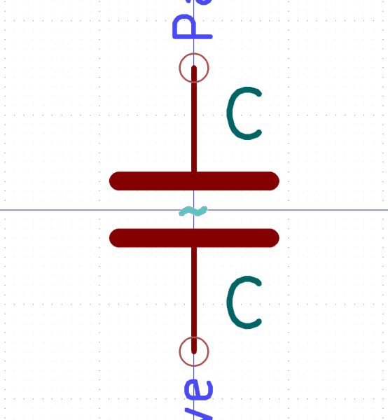
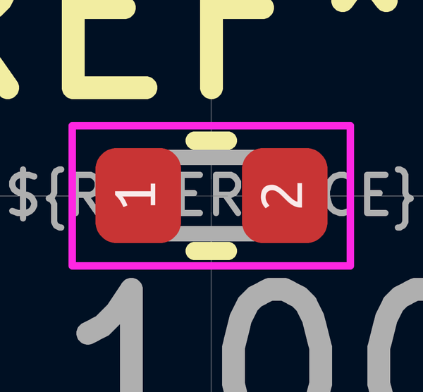

# Electronic Capacitor 0402 100 Nano Farad

  
* oomp_key: oomp_electronic_capacitor_0402_100_nano_farad 
* short_code: c4nf100
* md5_6: 59771c  
* github_link: https://github.com/oomlout/oomlout_oomp_part_src/tree/main/parts/electronic_capacitor_0402_100_nano_farad/working  
## naming details
* classification -- electronic
* type -- capacitor
* size -- 0402
* color -- 
* description_main -- 100_nano_farad
* description_extra -- 
* manucaturer -- 
* part_number -- 

## symbol

  
oomp_key: oomp_kicad_device_c  
link: https://github.com/oomlout/oomlout_oomp_symbol_bot/tree/main/symbols/kicad_device_c/working  

## footprint

  
oomp_key: oomp_kicad_capacitor_smd_c_0402_1005metric  
link: https://github.com/oomlout/oomlout_oomp_footprint_bot/tree/main/footprints/kicad_capacitor_smd_c_0402_1005metric/working  

## full_summary
| name | value | 
| --- | --- | 
| name | value | 
| classification | electronic | 
| type | capacitor | 
| size | 0402 | 
| color |  | 
| description_main | 100_nano_farad | 
| description_extra |  | 
| manufacturer |  | 
| part_number |  | 
| filter |  | 
| kicad_reference | C | 
| id | electronic_capacitor_0402_100_nano_farad | 
| id_no_class | capacitor_0402_100_nano_farad | 
| id_no_type | 0402_100_nano_farad | 
| oomp_key | oomp_electronic_capacitor_0402_100_nano_farad | 
| github_link | https://github.com/oomlout/oomlout_oomp_part_src/tree/main/parts/electronic_capacitor_0402_100_nano_farad/working | 
| directory | parts/electronic_capacitor_0402_100_nano_farad | 
| name | Electronic Capacitor 0402 100 Nano Farad | 
| short_code | c4nf100 | 
| short_code_upper | C4NF100 | 
| distributors | [] | 
| manufacturers | [] | 
| package_style | smd_tape | 
| smd_tape_width | 8_mm | 
| smd_tape_depth | 1_5_mm | 
| smd_tape_pitch | 2_mm | 
| md5 | 59771c4331f6c67b3f60f46b5ec35ee3 | 
| md5_5 | 59771 | 
| md5_5_upper | 59771 | 
| md5_6 | 59771c | 
| md5_6_upper | 59771C | 
| md5_6_alpha | 3ho2k | 
| md5_6_alpha_upper | 3HO2K | 
| md5_10 | 59771c4331 | 
| md5_10_upper | 59771C4331 | 
| type_first_letter | c | 
| type_first_letter_upper | C | 
| size_only_numbers | 0402 | 
| size_only_numbers_no_zeros | 42 | 
| color_upper |  | 
| color_first_letter |  | 
| color_first_letter_upper |  | 
| description_only_numbers | 100 | 
| description_only_numbers_short | 100 | 
| description_or_color | 100 | 
| description_or_color_upper | 100 | 
| markdown_full | [electronic_capacitor_0402_100_nano_farad](https://github.com/oomlout/oomlout_oomp_part_src/tree/main/parts/electronic_capacitor_0402_100_nano_farad/working) [c4nf100](https://github.com/oomlout/oomlout_oomp_part_src/tree/main/parts/electronic_capacitor_0402_100_nano_farad/working) [Electronic Capacitor 0402 100 Nano Farad](https://github.com/oomlout/oomlout_oomp_part_src/tree/main/parts/electronic_capacitor_0402_100_nano_farad/working)   | 
| markdown_short | [electronic_capacitor_0402_100_nano_farad](https://github.com/oomlout/oomlout_oomp_part_src/tree/main/parts/electronic_capacitor_0402_100_nano_farad/working)   | 
| footprint | [{'link': 'https://github.com/oomlout/oomlout_oomp_footprint_bot/tree/main/foootprntss/kicad_capacitor_smd_c_0402_1005metric', 'oomp_key': 'oomp_kicad_capacitor_smd_c_0402_1005metric', 'directory': 'oomlout_oomp_footprint_bot/footprints/kicad_capacitor_smd_c_0402_1005metric//working/working.kicad_mod'}] | 
| symbol | [{'link': 'https://github.com/oomlout/oomlout_oomp_symbol_bot/tree/main/symbols/kicad_device_c', 'oomp_key': 'oomp_kicad_device_c', 'directory': 'oomlout_oomp_symbol_bot/symbols/kicad_device_c//working/working.kicad_sym'}] | 
