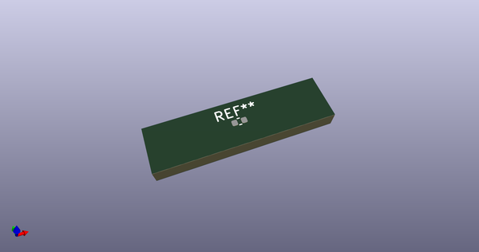
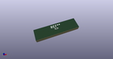

# OOMP Footprint  
## C_0402_1005Metric  by none  
  
oomp key: oomp_kicad_capacitor_smd_c_0402_1005metric  
  
source repo at: [http://gitlab.com/kicad/libraries/kicad-footprints//blob/master/tmp/libraries/kicad-footprints/Varistor.pretty/RV_Rect_V25S440P_L26.5mm_W8.2mm_P12.7mm.kicad_mod](http://gitlab.com/kicad/libraries/kicad-footprints//blob/master/tmp/libraries/kicad-footprints/Varistor.pretty/RV_Rect_V25S440P_L26.5mm_W8.2mm_P12.7mm.kicad_mod)  
## Footprint  
  
  
  
  
| name | value | 
| --- | --- | 
| footprint name | C_0402_1005Metric | 
| footprint description | Capacitor SMD 0402 (1005 Metric), square (rectangular) end terminal, IPC_7351 nominal, (Body size source: IPC-SM-782 page 76, https://www.pcb-3d.com/wordpress/wp-content/uploads/ipc-sm-782a_amendment_1_and_2.pdf), generated with kicad-footprint-generator | 
| number of pads | 2 | 
| github path | http://github.com/kicad/libraries/kicad-footprints//blob/master/tmp/libraries/kicad-footprints/Capacitor_SMD.pretty/C_0402_1005Metric.kicad_mod | 
| oomp key | oomp_kicad_capacitor_smd_c_0402_1005metric | 
| oomp bot github | https://github.com/oomlout/oomlout_oomp_footprint_bot/tree/main/footprints/kicad_capacitor_smd_c_0402_1005metric/working | 
## Images  
  
  
  
  
  
  
