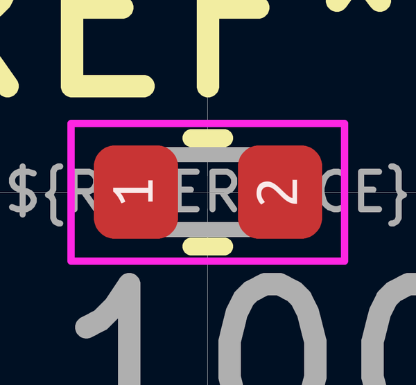

# Electronic Capacitor 0402 22 Pico Farad

  
* oomp_key: oomp_electronic_capacitor_0402_22_pico_farad 
* short_code: c4pf22
* md5_6: 800826  
* github_link: https://github.com/oomlout/oomlout_oomp_part_src/tree/main/parts/electronic_capacitor_0402_22_pico_farad/working  
## naming details
* classification -- electronic
* type -- capacitor
* size -- 0402
* color -- 
* description_main -- 22_pico_farad
* description_extra -- 
* manucaturer -- 
* part_number -- 

## symbol

  
oomp_key: oomp_kicad_device_c  
link: https://github.com/oomlout/oomlout_oomp_symbol_bot/tree/main/symbols/kicad_device_c/working  

## footprint

  
oomp_key: oomp_kicad_capacitor_smd_c_0402_1005metric  
link: https://github.com/oomlout/oomlout_oomp_footprint_bot/tree/main/footprints/kicad_capacitor_smd_c_0402_1005metric/working  

## full_summary
| name | value | 
| --- | --- | 
| name | value | 
| classification | electronic | 
| type | capacitor | 
| size | 0402 | 
| color |  | 
| description_main | 22_pico_farad | 
| description_extra |  | 
| manufacturer |  | 
| part_number |  | 
| filter |  | 
| kicad_reference | C | 
| id | electronic_capacitor_0402_22_pico_farad | 
| id_no_class | capacitor_0402_22_pico_farad | 
| id_no_type | 0402_22_pico_farad | 
| oomp_key | oomp_electronic_capacitor_0402_22_pico_farad | 
| github_link | https://github.com/oomlout/oomlout_oomp_part_src/tree/main/parts/electronic_capacitor_0402_22_pico_farad/working | 
| directory | parts/electronic_capacitor_0402_22_pico_farad | 
| name | Electronic Capacitor 0402 22 Pico Farad | 
| short_code | c4pf22 | 
| short_code_upper | C4PF22 | 
| distributors | [] | 
| manufacturers | [] | 
| md5 | 8008269b2a82f75ac1033a8691959122 | 
| md5_5 | 80082 | 
| md5_5_upper | 80082 | 
| md5_6 | 800826 | 
| md5_6_upper | 800826 | 
| md5_10 | 8008269b2a | 
| md5_10_upper | 8008269B2A | 
| type_first_letter | c | 
| type_first_letter_upper | C | 
| size_only_numbers | 0402 | 
| size_only_numbers_no_zeros | 42 | 
| color_upper |  | 
| color_first_letter |  | 
| color_first_letter_upper |  | 
| description_only_numbers | 22 | 
| description_only_numbers_short | 22 | 
| description_or_color | 22 | 
| description_or_color_upper | 22 | 
| markdown_full | [electronic_capacitor_0402_22_pico_farad](https://github.com/oomlout/oomlout_oomp_part_src/tree/main/parts/electronic_capacitor_0402_22_pico_farad/working) [c4pf22](https://github.com/oomlout/oomlout_oomp_part_src/tree/main/parts/electronic_capacitor_0402_22_pico_farad/working) [Electronic Capacitor 0402 22 Pico Farad](https://github.com/oomlout/oomlout_oomp_part_src/tree/main/parts/electronic_capacitor_0402_22_pico_farad/working)   | 
| markdown_short | [electronic_capacitor_0402_22_pico_farad](https://github.com/oomlout/oomlout_oomp_part_src/tree/main/parts/electronic_capacitor_0402_22_pico_farad/working)   | 
| footprint | [{'link': 'https://github.com/oomlout/oomlout_oomp_footprint_bot/tree/main/foootprntss/kicad_capacitor_smd_c_0402_1005metric', 'oomp_key': 'oomp_kicad_capacitor_smd_c_0402_1005metric', 'directory': 'oomlout_oomp_footprint_bot/footprints/kicad_capacitor_smd_c_0402_1005metric//working/working.kicad_mod'}] | 
| symbol | [{'link': 'https://github.com/oomlout/oomlout_oomp_symbol_bot/tree/main/symbols/kicad_device_c', 'oomp_key': 'oomp_kicad_device_c', 'directory': 'oomlout_oomp_symbol_bot/symbols/kicad_device_c//working/working.kicad_sym'}] | 
