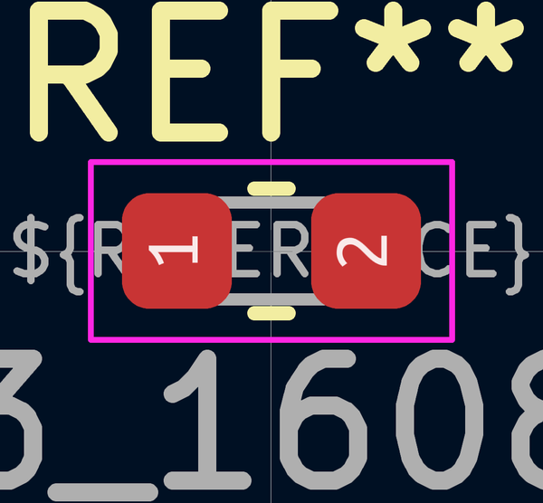

# Electronic Capacitor 0603 100 Nano Farad

  
* oomp_key: oomp_electronic_capacitor_0603_100_nano_farad 
* short_code: c6nf100
* md5_6: 8cfd91  
* github_link: https://github.com/oomlout/oomlout_oomp_part_src/tree/main/parts/electronic_capacitor_0603_100_nano_farad/working  
## naming details
* classification -- electronic
* type -- capacitor
* size -- 0603
* color -- 
* description_main -- 100_nano_farad
* description_extra -- 
* manucaturer -- 
* part_number -- 

## distributors
* [LCSC - C14663](https://lcsc.com/product-detail/C14663.html)  
* [LCSC - C30926](https://lcsc.com/product-detail/C30926.html)  
* [LCSC - C1591](https://lcsc.com/product-detail/C1591.html)  

## manufacturers
* [Samsung - CL10B104KB8NNNC](https://product.samsungsem.com/mlcc/CL10B104KB8NNN.do)  
* [Yageo - CC0603KRX7R9BB104](https://www.yageo.com/en/Chart/Download/pdf/CC0603KRX7R9BB104)  

## symbol

  
oomp_key: oomp_kicad_device_c  
link: https://github.com/oomlout/oomlout_oomp_symbol_bot/tree/main/symbols/kicad_device_c/working  

## footprint

  
oomp_key: oomp_kicad_capacitor_smd_c_0603_1608metric  
link: https://github.com/oomlout/oomlout_oomp_footprint_bot/tree/main/footprints/kicad_capacitor_smd_c_0603_1608metric/working  

## full_summary
| name | value | 
| --- | --- | 
| name | value | 
| classification | electronic | 
| type | capacitor | 
| size | 0603 | 
| color |  | 
| description_main | 100_nano_farad | 
| description_extra |  | 
| manufacturer |  | 
| part_number |  | 
| filter |  | 
| kicad_reference | C | 
| id | electronic_capacitor_0603_100_nano_farad | 
| oomp_key | oomp_electronic_capacitor_0603_100_nano_farad | 
| github_link | https://github.com/oomlout/oomlout_oomp_part_src/tree/main/parts/electronic_capacitor_0603_100_nano_farad/working | 
| directory | parts/electronic_capacitor_0603_100_nano_farad | 
| name | Electronic Capacitor 0603 100 Nano Farad | 
| short_code | c6nf100 | 
| distributors | [{'name': 'LCSC', 'part_number': 'C14663', 'link': 'https://lcsc.com/product-detail/C14663.html', 'id': 'distributor_lcsc'}, {'name': 'LCSC', 'part_number': 'C30926', 'link': 'https://lcsc.com/product-detail/C30926.html', 'id': 'distributor_lcsc'}, {'name': 'LCSC', 'part_number': 'C1591', 'link': 'https://lcsc.com/product-detail/C1591.html', 'id': 'distributor_lcsc'}] | 
| manufacturers | [{'name': 'Samsung', 'part_number': 'CL10B104KB8NNNC', 'link': 'https://product.samsungsem.com/mlcc/CL10B104KB8NNN.do', 'id': 'manufacturer_samsung'}, {'name': 'Yageo', 'part_number': 'CC0603KRX7R9BB104', 'link': 'https://www.yageo.com/en/Chart/Download/pdf/CC0603KRX7R9BB104', 'id': 'manufacturer_yageo'}] | 
| package_style | smd_tape | 
| smd_tape_width | 8_mm | 
| smd_tape_depth | 1_5_mm | 
| smd_tape_pitch | 4_mm | 
| md5 | 8cfd91c8b4af505f5c4d796bc12d1d16 | 
| md5_5 | 8cfd9 | 
| md5_6 | 8cfd91 | 
| md5_10 | 8cfd91c8b4 | 
| markdown_full | [electronic_capacitor_0603_100_nano_farad](https://github.com/oomlout/oomlout_oomp_part_src/tree/main/parts/electronic_capacitor_0603_100_nano_farad/working) [c6nf100](https://github.com/oomlout/oomlout_oomp_part_src/tree/main/parts/electronic_capacitor_0603_100_nano_farad/working) [Electronic Capacitor 0603 100 Nano Farad](https://github.com/oomlout/oomlout_oomp_part_src/tree/main/parts/electronic_capacitor_0603_100_nano_farad/working) [LCSC - C14663 ](https://lcsc.com/product-detail/C14663.html)[LCSC - C30926 ](https://lcsc.com/product-detail/C30926.html)[LCSC - C1591 ](https://lcsc.com/product-detail/C1591.html) [Samsung - CL10B104KB8NNNC](https://product.samsungsem.com/mlcc/CL10B104KB8NNN.do) [(L)  ](https://www.lcsc.com/search?q=CL10B104KB8NNNC)[(D)  ](https://www.digikey.com/en/products?keywords=CL10B104KB8NNNC)[(M)  ](https://www.mouser.com/Search/Refine?Keyword=CL10B104KB8NNNC)[(N)  ](https://www.newark.com/search?st=CL10B104KB8NNNC)[(SZ)  ](https://so.szlcsc.com/global.html?k=CL10B104KB8NNNC) [Yageo - CC0603KRX7R9BB104](https://www.yageo.com/en/Chart/Download/pdf/CC0603KRX7R9BB104) [(L)  ](https://www.lcsc.com/search?q=CC0603KRX7R9BB104)[(D)  ](https://www.digikey.com/en/products?keywords=CC0603KRX7R9BB104)[(M)  ](https://www.mouser.com/Search/Refine?Keyword=CC0603KRX7R9BB104)[(N)  ](https://www.newark.com/search?st=CC0603KRX7R9BB104)[(SZ)  ](https://so.szlcsc.com/global.html?k=CC0603KRX7R9BB104)  | 
| footprint | [{'link': 'https://github.com/oomlout/oomlout_oomp_footprint_bot/tree/main/foootprntss/kicad_capacitor_smd_c_0603_1608metric', 'oomp_key': 'oomp_kicad_capacitor_smd_c_0603_1608metric', 'directory': 'oomlout_oomp_footprint_bot/footprints/kicad_capacitor_smd_c_0603_1608metric//working/working.kicad_mod'}] | 
| symbol | [{'link': 'https://github.com/oomlout/oomlout_oomp_symbol_bot/tree/main/symbols/kicad_device_c', 'oomp_key': 'oomp_kicad_device_c', 'directory': 'oomlout_oomp_symbol_bot/symbols/kicad_device_c//working/working.kicad_sym'}] | 
