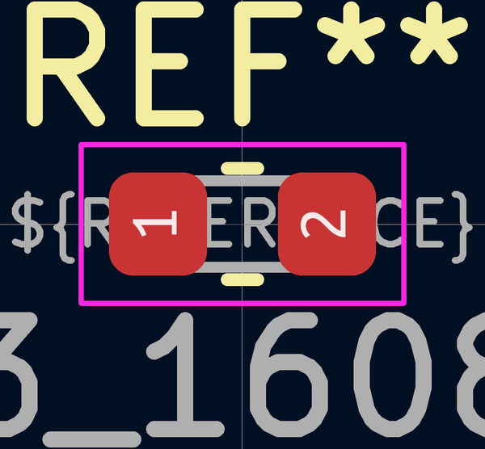

# Electronic Capacitor 0603 10 Nano Farad

  
* oomp_key: oomp_electronic_capacitor_0603_10_nano_farad 
* short_code: c6nf10
* md5_6: 33c290  
* github_link: https://github.com/oomlout/oomlout_oomp_part_src/tree/main/parts/electronic_capacitor_0603_10_nano_farad/working  
## naming details
* classification -- electronic
* type -- capacitor
* size -- 0603
* color -- 
* description_main -- 10_nano_farad
* description_extra -- 
* manucaturer -- 
* part_number -- 

## manufacturers
* [Yageo-CC0603KRX7R9BB103](https://www.yageo.com/en/Chart/Download/pdf/CC0603KRX7R9BB103)  

## symbol

  
oomp_key: oomp_kicad_device_c  
link: https://github.com/oomlout/oomlout_oomp_symbol_bot/tree/main/symbols/kicad_device_c/working  

## footprint

  
oomp_key: oomp_kicad_capacitor_smd_c_0603_1608metric  
link: https://github.com/oomlout/oomlout_oomp_footprint_bot/tree/main/foootprntss/kicad_capacitor_smd_c_0603_1608metric/working  

## full_summary
| name | value | 
| --- | --- | 
| name | value | 
| classification | electronic | 
| type | capacitor | 
| size | 0603 | 
| color |  | 
| description_main | 10_nano_farad | 
| description_extra |  | 
| manufacturer |  | 
| part_number |  | 
| filter |  | 
| kicad_reference | C | 
| id | electronic_capacitor_0603_10_nano_farad | 
| oomp_key | oomp_electronic_capacitor_0603_10_nano_farad | 
| github_link | https://github.com/oomlout/oomlout_oomp_part_src/tree/main/parts/electronic_capacitor_0603_10_nano_farad/working | 
| directory | parts/electronic_capacitor_0603_10_nano_farad | 
| name | Electronic Capacitor 0603 10 Nano Farad | 
| short_code | c6nf10 | 
| distributors | [] | 
| manufacturers | [{'name': 'Yageo', 'part_number': 'CC0603KRX7R9BB103', 'link': 'https://www.yageo.com/en/Chart/Download/pdf/CC0603KRX7R9BB103', 'id': 'manufacturer_yageo'}] | 
| md5 | 33c290430a925ac7c87bd31db1d1a8b7 | 
| md5_5 | 33c29 | 
| md5_6 | 33c290 | 
| md5_10 | 33c290430a | 
| footprint | [{'link': 'https://github.com/oomlout/oomlout_oomp_footprint_bot/tree/main/foootprntss/kicad_capacitor_smd_c_0603_1608metric', 'oomp_key': 'oomp_kicad_capacitor_smd_c_0603_1608metric', 'directory': 'oomlout_oomp_footprint_bot/footprints/kicad_capacitor_smd_c_0603_1608metric//working/working.kicad_mod'}] | 
| symbol | [{'link': 'https://github.com/oomlout/oomlout_oomp_symbol_bot/tree/main/symbols/kicad_device_c', 'oomp_key': 'oomp_kicad_device_c', 'directory': 'oomlout_oomp_symbol_bot/symbols/kicad_device_c//working/working.kicad_sym'}] | 
