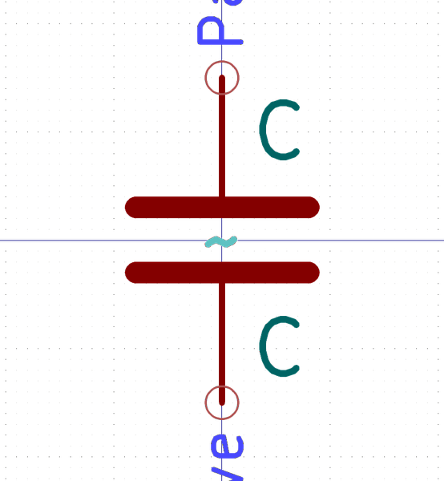

# Electronic Capacitor 0603 22 Pico Farad
oomp_key: oomp_electronic_capacitor_0603_22_pico_farad  

short_code: c6pf22
## naming details
* classification -- electronic
* type -- capacitor
* size -- 0603
* color -- 
* description_main -- 22_pico_farad
* description_extra -- 
* manucaturer -- 
* part_number -- 

## manufacturers
* [HCTL-TC-3601L-2.5-260G]()  
* [Yageo-CC0603JRNPO9BN220](https://www.yageo.com/en/Chart/Download/pdf/CC0603JRNPO9BN220)  

## symbol

  
oomp_key: oomp_kicad_device_c  
link: https://github.com/oomlout/oomlout_oomp_symbol_bot/tree/main/symbols/kicad_device_c/working  

## footprint

  
oomp_key: oomp_kicad_capacitor_smd_c_0603_1608metric  
link: https://github.com/oomlout/oomlout_oomp_footprint_bot/tree/main/foootprntss/kicad_capacitor_smd_c_0603_1608metric/working  
