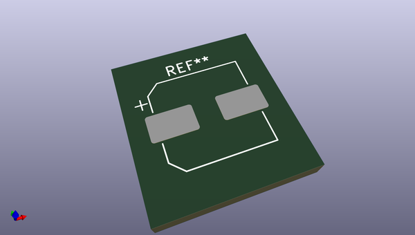
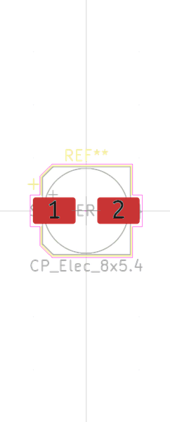
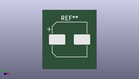

# OOMP Footprint  
## CP_EIA-3216-18_Kemet-A  by oomlout  
  
oomp key: oomp_oomlout_oomlout_oomp_part_footprints_catuf4d7v16_electronic_capacitor_3216_avx_a_tantalum_4_7_micro_farad_16_volt  
  
source repo at: [http://github.com/oomlout/oomlout_oomp_part_kicad_footprints/blob/master/tmp/data/oomlout_oomp_footprint_src/oomlout_oomp_part_footprints.pretty/xcr3213mhz8_electronic_ceramic_resonator_3213_3_pin_ground_pin_2_8_mega_hertz_1.kicad_mod](http://github.com/oomlout/oomlout_oomp_part_kicad_footprints/blob/master/tmp/data/oomlout_oomp_footprint_src/oomlout_oomp_part_footprints.pretty/xcr3213mhz8_electronic_ceramic_resonator_3213_3_pin_ground_pin_2_8_mega_hertz_1.kicad_mod)  
## Footprint  
  
  
  
  
| name | value | 
| --- | --- | 
| footprint name | CP_EIA-3216-18_Kemet-A | 
| footprint description | Tantalum Capacitor SMD Kemet-A (3216-18 Metric), IPC_7351 nominal, (Body size from: http://www.kemet.com/Lists/ProductCatalog/Attachments/253/KEM_TC101_STD.pdf), generated with kicad-footprint-generator | 
| number of pads | 2 | 
| github path | http://github.com/oomlout/oomlout_oomp_part_kicad_footprints/blob/master/tmp/data/oomlout_oomp_footprint_src/oomlout_oomp_part_footprints.pretty/catuf4d7v16_electronic_capacitor_3216_avx_a_tantalum_4_7_micro_farad_16_volt.kicad_mod | 
| oomp key | oomp_oomlout_oomlout_oomp_part_footprints_catuf4d7v16_electronic_capacitor_3216_avx_a_tantalum_4_7_micro_farad_16_volt | 
| oomp bot github | https://github.com/oomlout/oomlout_oomp_footprint_bot/tree/main/tmp/data/oomlout_oomp_footprint_src/footprints/oomlout_oomlout_oomp_part_footprints_catuf4d7v16_electronic_capacitor_3216_avx_a_tantalum_4_7_micro_farad_16_volt/working | 
## Images  
  
  
  
  
  
  
  
  
