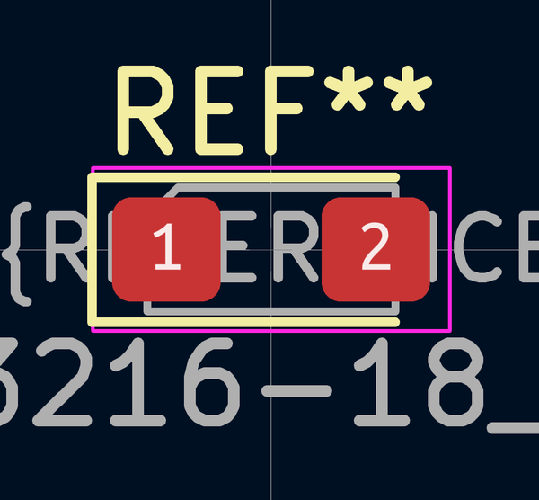

# Electronic Capacitor 3216 Avx A Tantalum 4 7 Micro Farad 16 Volt

  
* oomp_key: oomp_electronic_capacitor_3216_avx_a_tantalum_4_7_micro_farad_16_volt 
* short_code: catuf4d716v
* md5_6: 951eeb  
* github_link: https://github.com/oomlout/oomlout_oomp_part_src/tree/main/parts/electronic_capacitor_3216_avx_a_tantalum_4_7_micro_farad_16_volt/working  
## naming details
* classification -- electronic
* type -- capacitor
* size -- 3216_avx_a
* color -- tantalum
* description_main -- 4_7_micro_farad
* description_extra -- 16_volt
* manucaturer -- 
* part_number -- 

## distributors
* [LCSC - C7187](https://lcsc.com/product-detail/C7187.html)  

## manufacturers
* [Kyocera - TAJA475K016RNJ](https://search.kyocera-avx.com/search/TAJA475K016RNJ)  

## symbol

  
oomp_key: oomp_kicad_device_c_polarized  
link: https://github.com/oomlout/oomlout_oomp_symbol_bot/tree/main/symbols/kicad_device_c_polarized/working  

## footprint

  
oomp_key: oomp_kicad_capacitor_tantalum_smd_cp_eia_3216_18_kemet_a  
link: https://github.com/oomlout/oomlout_oomp_footprint_bot/tree/main/foootprntss/kicad_capacitor_tantalum_smd_cp_eia_3216_18_kemet_a/working  

## full_summary
| name | value | 
| --- | --- | 
| name | value | 
| classification | electronic | 
| type | capacitor | 
| size | 3216_avx_a | 
| color | tantalum | 
| description_main | 4_7_micro_farad | 
| description_extra | 16_volt | 
| manufacturer |  | 
| part_number |  | 
| filter |  | 
| kicad_reference | C | 
| id | electronic_capacitor_3216_avx_a_tantalum_4_7_micro_farad_16_volt | 
| oomp_key | oomp_electronic_capacitor_3216_avx_a_tantalum_4_7_micro_farad_16_volt | 
| github_link | https://github.com/oomlout/oomlout_oomp_part_src/tree/main/parts/electronic_capacitor_3216_avx_a_tantalum_4_7_micro_farad_16_volt/working | 
| directory | parts/electronic_capacitor_3216_avx_a_tantalum_4_7_micro_farad_16_volt | 
| name | Electronic Capacitor 3216 Avx A Tantalum 4 7 Micro Farad 16 Volt | 
| short_code | catuf4d716v | 
| distributors | [{'name': 'LCSC', 'part_number': 'C7187', 'link': 'https://lcsc.com/product-detail/C7187.html', 'id': 'distributor_lcsc'}] | 
| manufacturers | [{'name': 'Kyocera', 'part_number': 'TAJA475K016RNJ', 'link': 'https://search.kyocera-avx.com/search/TAJA475K016RNJ', 'id': 'manufacturer_kyocera'}] | 
| md5 | 951eebab538d3a391eb9ef33560a6b6b | 
| md5_5 | 951ee | 
| md5_6 | 951eeb | 
| md5_10 | 951eebab53 | 
| footprint | [{'link': 'https://github.com/oomlout/oomlout_oomp_footprint_bot/tree/main/foootprntss/kicad_capacitor_tantalum_smd_cp_eia_3216_18_kemet_a', 'oomp_key': 'oomp_kicad_capacitor_tantalum_smd_cp_eia_3216_18_kemet_a', 'directory': 'oomlout_oomp_footprint_bot/footprints/kicad_capacitor_tantalum_smd_cp_eia_3216_18_kemet_a//working/working.kicad_mod'}] | 
| symbol | [{'link': 'https://github.com/oomlout/oomlout_oomp_symbol_bot/tree/main/symbols/kicad_device_c_polarized', 'oomp_key': 'oomp_kicad_device_c_polarized', 'directory': 'oomlout_oomp_symbol_bot/symbols/kicad_device_c_polarized//working/working.kicad_sym'}] | 
