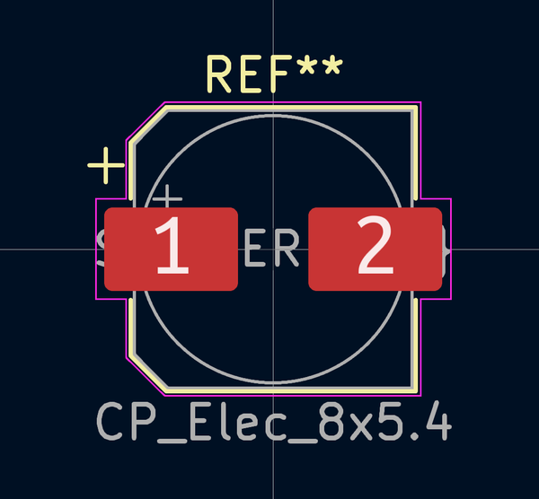

# Electronic Capacitor 8 Mm Diameter 6 5 Mm Tall 220 Micro Farad 10 Volt

  
* oomp_key: oomp_electronic_capacitor_8_mm_diameter_6_5_mm_tall_220_micro_farad_10_volt 
* short_code: c8d65tuf22010v
* md5_6: 289cad  
* github_link: https://github.com/oomlout/oomlout_oomp_part_src/tree/main/parts/electronic_capacitor_8_mm_diameter_6_5_mm_tall_220_micro_farad_10_volt/working  
## naming details
* classification -- electronic
* type -- capacitor
* size -- 8_mm_diameter_6_5_mm_tall
* color -- 
* description_main -- 220_micro_farad
* description_extra -- 10_volt
* manucaturer -- 
* part_number -- 

## distributors
* [LCSC - C249496](https://lcsc.com/product-detail/C249496.html)   

## symbol

  
oomp_key: oomp_kicad_device_c  
link: https://github.com/oomlout/oomlout_oomp_symbol_bot/tree/main/symbols/kicad_device_c/working  

## footprint

  
oomp_key: oomp_kicad_capacitor_smd_cp_elec_8x5_4  
link: https://github.com/oomlout/oomlout_oomp_footprint_bot/tree/main/footprints/kicad_capacitor_smd_cp_elec_8x5_4/working  

## full_summary
| name | value | 
| --- | --- | 
| name | value | 
| classification | electronic | 
| type | capacitor | 
| size | 8_mm_diameter_6_5_mm_tall | 
| color |  | 
| description_main | 220_micro_farad | 
| description_extra | 10_volt | 
| manufacturer |  | 
| part_number |  | 
| filter |  | 
| kicad_reference | C | 
| id | electronic_capacitor_8_mm_diameter_6_5_mm_tall_220_micro_farad_10_volt | 
| id_no_class | capacitor_8_mm_diameter_6_5_mm_tall_220_micro_farad_10_volt | 
| id_no_type | 8_mm_diameter_6_5_mm_tall_220_micro_farad_10_volt | 
| oomp_key | oomp_electronic_capacitor_8_mm_diameter_6_5_mm_tall_220_micro_farad_10_volt | 
| github_link | https://github.com/oomlout/oomlout_oomp_part_src/tree/main/parts/electronic_capacitor_8_mm_diameter_6_5_mm_tall_220_micro_farad_10_volt/working | 
| directory | parts/electronic_capacitor_8_mm_diameter_6_5_mm_tall_220_micro_farad_10_volt | 
| name | Electronic Capacitor 8 Mm Diameter 6 5 Mm Tall 220 Micro Farad 10 Volt | 
| short_code | c8d65tuf22010v | 
| short_code_upper | C8D65TUF22010V | 
| distributors | [{'name': 'LCSC', 'part_number': 'C249496', 'link': 'https://lcsc.com/product-detail/C249496.html', 'id': 'distributor_lcsc'}] | 
| manufacturers | [] | 
| md5 | 289cad5b90c1b47f386b4ddb984aada6 | 
| md5_5 | 289ca | 
| md5_5_upper | 289CA | 
| md5_6 | 289cad | 
| md5_6_upper | 289CAD | 
| md5_10 | 289cad5b90 | 
| md5_10_upper | 289CAD5B90 | 
| type_first_letter | c | 
| type_first_letter_upper | C | 
| size_only_numbers | 865 | 
| size_only_numbers_no_zeros | 865 | 
| color_upper |  | 
| color_first_letter |  | 
| color_first_letter_upper |  | 
| description_only_numbers | 220 | 
| description_only_numbers_short | 220 | 
| description_or_color | 220 | 
| description_or_color_upper | 220 | 
| markdown_full | [electronic_capacitor_8_mm_diameter_6_5_mm_tall_220_micro_farad_10_volt](https://github.com/oomlout/oomlout_oomp_part_src/tree/main/parts/electronic_capacitor_8_mm_diameter_6_5_mm_tall_220_micro_farad_10_volt/working) [c8d65tuf22010v](https://github.com/oomlout/oomlout_oomp_part_src/tree/main/parts/electronic_capacitor_8_mm_diameter_6_5_mm_tall_220_micro_farad_10_volt/working) [Electronic Capacitor 8 Mm Diameter 6 5 Mm Tall 220 Micro Farad 10 Volt](https://github.com/oomlout/oomlout_oomp_part_src/tree/main/parts/electronic_capacitor_8_mm_diameter_6_5_mm_tall_220_micro_farad_10_volt/working) [LCSC - C249496 ](https://lcsc.com/product-detail/C249496.html)  | 
| markdown_short | [electronic_capacitor_8_mm_diameter_6_5_mm_tall_220_micro_farad_10_volt](https://github.com/oomlout/oomlout_oomp_part_src/tree/main/parts/electronic_capacitor_8_mm_diameter_6_5_mm_tall_220_micro_farad_10_volt/working) [LCSC - C249496 ](https://lcsc.com/product-detail/C249496.html)  | 
| footprint | [{'link': 'https://github.com/oomlout/oomlout_oomp_footprint_bot/tree/main/foootprntss/kicad_capacitor_smd_cp_elec_8x5_4', 'oomp_key': 'oomp_kicad_capacitor_smd_cp_elec_8x5_4', 'directory': 'oomlout_oomp_footprint_bot/footprints/kicad_capacitor_smd_cp_elec_8x5_4//working/working.kicad_mod'}] | 
| symbol | [{'link': 'https://github.com/oomlout/oomlout_oomp_symbol_bot/tree/main/symbols/kicad_device_c', 'oomp_key': 'oomp_kicad_device_c', 'directory': 'oomlout_oomp_symbol_bot/symbols/kicad_device_c//working/working.kicad_sym'}] | 
