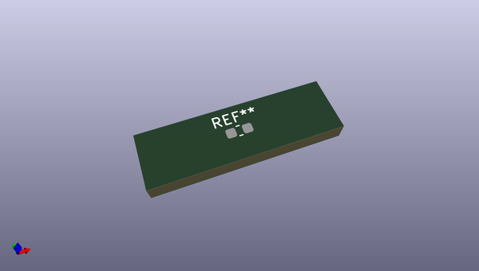

# OOMP Footprint  
## CP_Elec_8x5.4  by oomlout  
  
oomp key: oomp_oomlout_oomlout_oomp_part_footprints_c8d65tuf220v10_electronic_capacitor_8_mm_diameter_6_5_mm_tall_electrolytic_220_micro_farad_10_volt  
  
source repo at: [http://github.com/oomlout/oomlout_oomp_part_kicad_footprints/blob/master/tmp/data/oomlout_oomp_footprint_src/oomlout_oomp_part_footprints.pretty/xcr3213mhz8_electronic_ceramic_resonator_3213_3_pin_ground_pin_2_8_mega_hertz_1.kicad_mod](http://github.com/oomlout/oomlout_oomp_part_kicad_footprints/blob/master/tmp/data/oomlout_oomp_footprint_src/oomlout_oomp_part_footprints.pretty/xcr3213mhz8_electronic_ceramic_resonator_3213_3_pin_ground_pin_2_8_mega_hertz_1.kicad_mod)  
## Footprint  
  
  
  
  
| name | value | 
| --- | --- | 
| footprint name | CP_Elec_8x5.4 | 
| footprint description | SMD capacitor, aluminum electrolytic, Nichicon, 8.0x5.4mm | 
| number of pads | 2 | 
| github path | http://github.com/oomlout/oomlout_oomp_part_kicad_footprints/blob/master/tmp/data/oomlout_oomp_footprint_src/oomlout_oomp_part_footprints.pretty/c8d65tuf220v10_electronic_capacitor_8_mm_diameter_6_5_mm_tall_electrolytic_220_micro_farad_10_volt.kicad_mod | 
| oomp key | oomp_oomlout_oomlout_oomp_part_footprints_c8d65tuf220v10_electronic_capacitor_8_mm_diameter_6_5_mm_tall_electrolytic_220_micro_farad_10_volt | 
| oomp bot github | https://github.com/oomlout/oomlout_oomp_footprint_bot/tree/main/tmp/data/oomlout_oomp_footprint_src/footprints/oomlout_oomlout_oomp_part_footprints_c8d65tuf220v10_electronic_capacitor_8_mm_diameter_6_5_mm_tall_electrolytic_220_micro_farad_10_volt/working | 
## Images  
