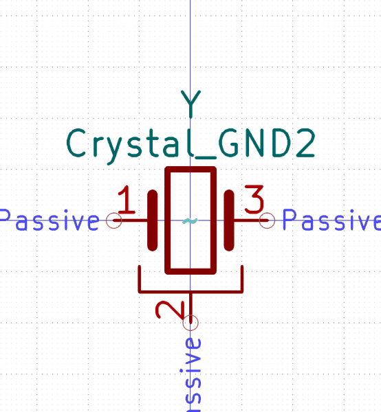

# Electronic Ceramic Resonator 3213 3 Pin Ground Pin 2 12 Mega Hertz
oomp_key: oomp_electronic_ceramic_resonator_3213_3_pin_ground_pin_2_12_mega_hertz  

short_code: xcr3213mhz12
## naming details
* classification -- electronic
* type -- ceramic_resonator
* size -- 3213
* color -- 3_pin_ground_pin_2
* description_main -- 12_mega_hertz
* description_extra -- 
* manucaturer -- 
* part_number -- 
## pinout
  
List of Pins:

## symbol

  
oomp_key: oomp_kicad_device_crystal_gnd2  
link: https://github.com/oomlout/oomlout_oomp_symbol_bot/tree/main/symbols/kicad_device_crystal_gnd2/working  

## footprint

  
oomp_key: oomp_kicad_crystal_resonator_smd_murata_cstxexxv_3pin_3_0x1_1mm  
link: https://github.com/oomlout/oomlout_oomp_footprint_bot/tree/main/foootprntss/kicad_crystal_resonator_smd_murata_cstxexxv_3pin_3_0x1_1mm/working  
