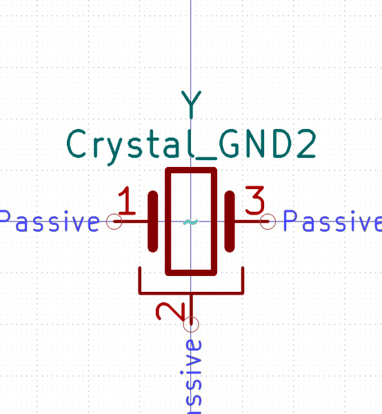

# Electronic Ceramic Resonator 3213 3 Pin Ground Pin 2 8 Mega Hertz

  
* oomp_key: oomp_electronic_ceramic_resonator_3213_3_pin_ground_pin_2_8_mega_hertz 
* short_code: xcr3213mhz8
* md5_6: fbf4f6  
* github_link: https://github.com/oomlout/oomlout_oomp_part_src/tree/main/parts/electronic_ceramic_resonator_3213_3_pin_ground_pin_2_8_mega_hertz/working  
## naming details
* classification -- electronic
* type -- ceramic_resonator
* size -- 3213
* color -- 3_pin_ground_pin_2
* description_main -- 8_mega_hertz
* description_extra -- 
* manucaturer -- 
* part_number -- 

## symbol

  
oomp_key: oomp_kicad_device_crystal_gnd2  
link: https://github.com/oomlout/oomlout_oomp_symbol_bot/tree/main/symbols/kicad_device_crystal_gnd2/working  

## footprint

  
oomp_key: oomp_kicad_crystal_resonator_smd_murata_cstxexxv_3pin_3_0x1_1mm  
link: https://github.com/oomlout/oomlout_oomp_footprint_bot/tree/main/footprints/kicad_crystal_resonator_smd_murata_cstxexxv_3pin_3_0x1_1mm/working  

## full_summary
| name | value | 
| --- | --- | 
| name | value | 
| classification | electronic | 
| type | ceramic_resonator | 
| size | 3213 | 
| color | 3_pin_ground_pin_2 | 
| description_main | 8_mega_hertz | 
| description_extra |  | 
| manufacturer |  | 
| part_number |  | 
| filter |  | 
| kicad_reference | x | 
| id | electronic_ceramic_resonator_3213_3_pin_ground_pin_2_8_mega_hertz | 
| oomp_key | oomp_electronic_ceramic_resonator_3213_3_pin_ground_pin_2_8_mega_hertz | 
| github_link | https://github.com/oomlout/oomlout_oomp_part_src/tree/main/parts/electronic_ceramic_resonator_3213_3_pin_ground_pin_2_8_mega_hertz/working | 
| directory | parts/electronic_ceramic_resonator_3213_3_pin_ground_pin_2_8_mega_hertz | 
| name | Electronic Ceramic Resonator 3213 3 Pin Ground Pin 2 8 Mega Hertz | 
| short_code | xcr3213mhz8 | 
| short_code_upper | XCR3213MHZ8 | 
| distributors | [] | 
| manufacturers | [] | 
| md5 | fbf4f6bd8d89a3cb1a67c8e2973297b3 | 
| md5_5 | fbf4f | 
| md5_6 | fbf4f6 | 
| md5_10 | fbf4f6bd8d | 
| markdown_full | [electronic_ceramic_resonator_3213_3_pin_ground_pin_2_8_mega_hertz](https://github.com/oomlout/oomlout_oomp_part_src/tree/main/parts/electronic_ceramic_resonator_3213_3_pin_ground_pin_2_8_mega_hertz/working) [xcr3213mhz8](https://github.com/oomlout/oomlout_oomp_part_src/tree/main/parts/electronic_ceramic_resonator_3213_3_pin_ground_pin_2_8_mega_hertz/working) [Electronic Ceramic Resonator 3213 3 Pin Ground Pin 2 8 Mega Hertz](https://github.com/oomlout/oomlout_oomp_part_src/tree/main/parts/electronic_ceramic_resonator_3213_3_pin_ground_pin_2_8_mega_hertz/working)   | 
| markdown_short | [electronic_ceramic_resonator_3213_3_pin_ground_pin_2_8_mega_hertz](https://github.com/oomlout/oomlout_oomp_part_src/tree/main/parts/electronic_ceramic_resonator_3213_3_pin_ground_pin_2_8_mega_hertz/working)   | 
| footprint | [{'link': 'https://github.com/oomlout/oomlout_oomp_footprint_bot/tree/main/foootprntss/kicad_crystal_resonator_smd_murata_cstxexxv_3pin_3_0x1_1mm', 'oomp_key': 'oomp_kicad_crystal_resonator_smd_murata_cstxexxv_3pin_3_0x1_1mm', 'directory': 'oomlout_oomp_footprint_bot/footprints/kicad_crystal_resonator_smd_murata_cstxexxv_3pin_3_0x1_1mm//working/working.kicad_mod'}] | 
| symbol | [{'link': 'https://github.com/oomlout/oomlout_oomp_symbol_bot/tree/main/symbols/kicad_device_crystal_gnd2', 'oomp_key': 'oomp_kicad_device_crystal_gnd2', 'directory': 'oomlout_oomp_symbol_bot/symbols/kicad_device_crystal_gnd2//working/working.kicad_sym'}] | 
