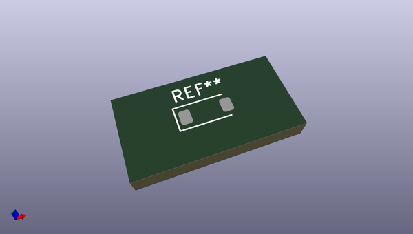
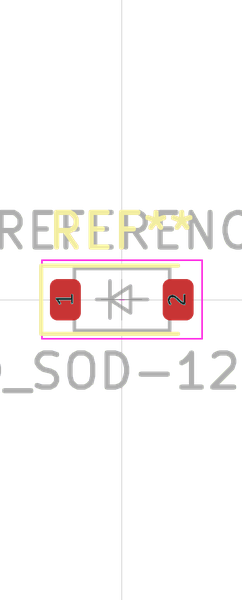

# OOMP Footprint  
## D_SOD-123  by oomlout  
  
oomp key: oomp_oomlout_oomlout_oomp_part_footprints_dssod123pmb2mbr0520_electronic_diode_schottky_sod_123_package_marking_b2_mbr0520  
  
source repo at: [http://github.com/oomlout/oomlout_oomp_part_kicad_footprints/blob/master/tmp/data/oomlout_oomp_footprint_src/oomlout_oomp_part_footprints.pretty/xcr3213mhz8_electronic_ceramic_resonator_3213_3_pin_ground_pin_2_8_mega_hertz_1.kicad_mod](http://github.com/oomlout/oomlout_oomp_part_kicad_footprints/blob/master/tmp/data/oomlout_oomp_footprint_src/oomlout_oomp_part_footprints.pretty/xcr3213mhz8_electronic_ceramic_resonator_3213_3_pin_ground_pin_2_8_mega_hertz_1.kicad_mod)  
## Footprint  
  
  
  
  
| name | value | 
| --- | --- | 
| footprint name | D_SOD-123 | 
| footprint description | SOD-123 | 
| number of pads | 2 | 
| github path | http://github.com/oomlout/oomlout_oomp_part_kicad_footprints/blob/master/tmp/data/oomlout_oomp_footprint_src/oomlout_oomp_part_footprints.pretty/dssod123pmb2mbr0520_electronic_diode_schottky_sod_123_package_marking_b2_mbr0520.kicad_mod | 
| oomp key | oomp_oomlout_oomlout_oomp_part_footprints_dssod123pmb2mbr0520_electronic_diode_schottky_sod_123_package_marking_b2_mbr0520 | 
| oomp bot github | https://github.com/oomlout/oomlout_oomp_footprint_bot/tree/main/tmp/data/oomlout_oomp_footprint_src/footprints/oomlout_oomlout_oomp_part_footprints_dssod123pmb2mbr0520_electronic_diode_schottky_sod_123_package_marking_b2_mbr0520/working | 
## Images  
