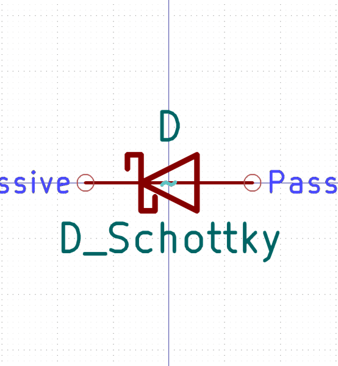
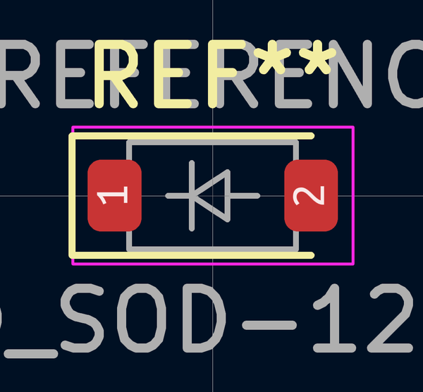

# Electronic Diode Schottky Sod 123 Package Marking B2 Mbr0520

  
* oomp_key: oomp_electronic_diode_schottky_sod_123_package_marking_b2_mbr0520 
* short_code: dssod123pmb2
* md5_6: fd1bfb  
* github_link: https://github.com/oomlout/oomlout_oomp_part_src/tree/main/parts/electronic_diode_schottky_sod_123_package_marking_b2_mbr0520/working  
## naming details
* classification -- electronic
* type -- diode_schottky
* size -- sod_123
* color -- 
* description_main -- 
* description_extra -- package_marking_b2
* manucaturer -- 
* part_number -- mbr0520

## distributors
* [LCSC - C77335](https://lcsc.com/product-detail/C77335.html)  
* [LCSC - C475717](https://lcsc.com/product-detail/C475717.html)  

## manufacturers
* [Jiangsu Changjing Electronics Technology Co., Ltd. - MBR0520]()  
* [Shikues - MBR0520]()  
* [onsemi - MBR0520LT3G]()  

## symbol

  
oomp_key: oomp_kicad_device_d_schottky  
link: https://github.com/oomlout/oomlout_oomp_symbol_bot/tree/main/symbols/kicad_device_d_schottky/working  

## footprint

  
oomp_key: oomp_kicad_diode_smd_d_sod_123  
link: https://github.com/oomlout/oomlout_oomp_footprint_bot/tree/main/foootprntss/kicad_diode_smd_d_sod_123/working  

## full_summary
| name | value | 
| --- | --- | 
| name | value | 
| classification | electronic | 
| type | diode_schottky | 
| size | sod_123 | 
| color |  | 
| description_main |  | 
| description_extra | package_marking_b2 | 
| manufacturer |  | 
| part_number | mbr0520 | 
| filter |  | 
| kicad_reference | D | 
| id | electronic_diode_schottky_sod_123_package_marking_b2_mbr0520 | 
| oomp_key | oomp_electronic_diode_schottky_sod_123_package_marking_b2_mbr0520 | 
| github_link | https://github.com/oomlout/oomlout_oomp_part_src/tree/main/parts/electronic_diode_schottky_sod_123_package_marking_b2_mbr0520/working | 
| directory | parts/electronic_diode_schottky_sod_123_package_marking_b2_mbr0520 | 
| name | Electronic Diode Schottky Sod 123 Package Marking B2 Mbr0520 | 
| short_code | dssod123pmb2 | 
| distributors | [{'name': 'LCSC', 'part_number': 'C77335', 'link': 'https://lcsc.com/product-detail/C77335.html', 'id': 'distributor_lcsc'}, {'name': 'LCSC', 'part_number': 'C475717', 'link': 'https://lcsc.com/product-detail/C475717.html', 'id': 'distributor_lcsc'}] | 
| manufacturers | [{'name': 'Jiangsu Changjing Electronics Technology Co., Ltd.', 'part_number': 'MBR0520', 'link': '', 'id': 'manufacturer_jiangsu_changjing_electronics_technology_co_ltd'}, {'name': 'Shikues', 'part_number': 'MBR0520', 'link': '', 'id': 'manufacturer_shikues'}, {'name': 'onsemi', 'part_number': 'MBR0520LT3G', 'link': '', 'id': 'manufacturer_onsemi'}] | 
| md5 | fd1bfba95edbbb6f03cb0e465b2a0493 | 
| md5_5 | fd1bf | 
| md5_6 | fd1bfb | 
| md5_10 | fd1bfba95e | 
| footprint | [{'link': 'https://github.com/oomlout/oomlout_oomp_footprint_bot/tree/main/foootprntss/kicad_diode_smd_d_sod_123', 'oomp_key': 'oomp_kicad_diode_smd_d_sod_123', 'directory': 'oomlout_oomp_footprint_bot/footprints/kicad_diode_smd_d_sod_123//working/working.kicad_mod'}] | 
| symbol | [{'link': 'https://github.com/oomlout/oomlout_oomp_symbol_bot/tree/main/symbols/kicad_device_d_schottky', 'oomp_key': 'oomp_kicad_device_d_schottky', 'directory': 'oomlout_oomp_symbol_bot/symbols/kicad_device_d_schottky//working/working.kicad_sym'}] | 
