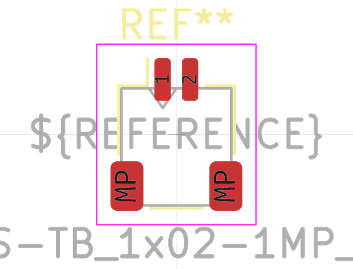

# Electronic Header 1 Mm Jst Sh 2 Pin Surface Mount Right Angle
oomp_key: oomp_electronic_header_1_mm_jst_sh_2_pin_surface_mount_right_angle  

short_code: h2psmra
## naming details
* classification -- electronic
* type -- header
* size -- 1_mm_jst_sh
* color -- 
* description_main -- 2_pin
* description_extra -- surface_mount_right_angle
* manucaturer -- 
* part_number -- 
## pinout

List of Pins:

## symbol

  
oomp_key: oomp_kicad_connector_conn_01x02_pin  
link: https://github.com/oomlout/oomlout_oomp_symbol_bot/tree/main/symbols/kicad_connector_conn_01x02_pin/working  

## footprint

  
oomp_key: oomp_kicad_connector_jst_jst_sh_sm02b_srss_tb_1x02_1mp_p1_00mm_horizontal  
link: https://github.com/oomlout/oomlout_oomp_footprint_bot/tree/main/foootprntss/kicad_connector_jst_jst_sh_sm02b_srss_tb_1x02_1mp_p1_00mm_horizontal/working  
