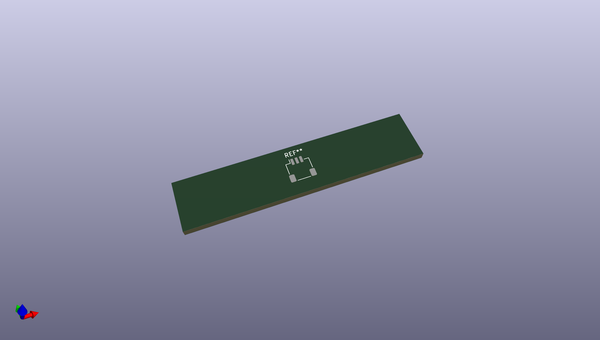
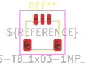
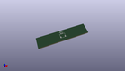

# OOMP Footprint  
## JST_SH_SM03B-SRSS-TB_1x03-1MP_P1.00mm_Horizontal  by none  
  
oomp key: oomp_kicad_connector_jst_jst_sh_sm03b_srss_tb_1x03_1mp_p1_00mm_horizontal  
  
source repo at: [http://gitlab.com/kicad/kicad-footprints/blob/master/tmp/data//oomlout_oomp_footprint_src/Varistor.pretty/RV_Rect_V25S440P_L26.5mm_W8.2mm_P12.7mm.kicad_mod](http://gitlab.com/kicad/kicad-footprints/blob/master/tmp/data//oomlout_oomp_footprint_src/Varistor.pretty/RV_Rect_V25S440P_L26.5mm_W8.2mm_P12.7mm.kicad_mod)  
## Footprint  
  
  
  
  
| name | value | 
| --- | --- | 
| footprint name | JST_SH_SM03B-SRSS-TB_1x03-1MP_P1.00mm_Horizontal | 
| footprint description | JST SH series connector, SM03B-SRSS-TB (http://www.jst-mfg.com/product/pdf/eng/eSH.pdf), generated with kicad-footprint-generator | 
| number of pads | 5 | 
| github path | http://github.com/kicad/kicad-footprints/blob/master/tmp/data//oomlout_oomp_footprint_src/Connector_JST.pretty/JST_SH_SM03B-SRSS-TB_1x03-1MP_P1.00mm_Horizontal.kicad_mod | 
| oomp key | oomp_kicad_connector_jst_jst_sh_sm03b_srss_tb_1x03_1mp_p1_00mm_horizontal | 
| oomp bot github | https://github.com/oomlout/oomlout_oomp_footprint_bot/tree/main/tmp/data//oomlout_oomp_footprint_src/footprints/kicad_connector_jst_jst_sh_sm03b_srss_tb_1x03_1mp_p1_00mm_horizontal/working | 
## Images  
  
  
  
  
  
  
  
  
