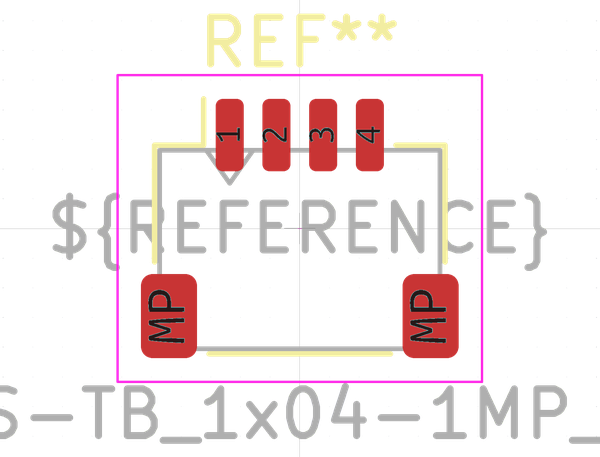

# Electronic Header 1 Mm Jst Sh 4 Pin Surface Mount Right Angle

  
* oomp_key: oomp_electronic_header_1_mm_jst_sh_4_pin_surface_mount_right_angle 
* short_code: h4psmra
* md5_6: adfe77  
* github_link: https://github.com/oomlout/oomlout_oomp_part_src/tree/main/parts/electronic_header_1_mm_jst_sh_4_pin_surface_mount_right_angle/working  
## naming details
* classification -- electronic
* type -- header
* size -- 1_mm_jst_sh
* color -- 
* description_main -- 4_pin
* description_extra -- surface_mount_right_angle
* manucaturer -- 
* part_number -- 

## distributors
* [LCSC - C145956](https://lcsc.com/product-detail/C145956.html)   
* [LCSC - C2906270](https://lcsc.com/product-detail/C2906270.html)   

## manufacturers
* [JST - SM04B-SRSS-TB](https://www.jst-mfg.com/product/index.php?series=231)  

## symbol

  
oomp_key: oomp_kicad_connector_conn_01x04_pin  
link: https://github.com/oomlout/oomlout_oomp_symbol_bot/tree/main/symbols/kicad_connector_conn_01x04_pin/working  

## footprint

  
oomp_key: oomp_kicad_connector_jst_jst_sh_sm04b_srss_tb_1x04_1mp_p1_00mm_horizontal  
link: https://github.com/oomlout/oomlout_oomp_footprint_bot/tree/main/footprints/kicad_connector_jst_jst_sh_sm04b_srss_tb_1x04_1mp_p1_00mm_horizontal/working  

## full_summary
| name | value | 
| --- | --- | 
| name | value | 
| classification | electronic | 
| type | header | 
| size | 1_mm_jst_sh | 
| color |  | 
| description_main | 4_pin | 
| description_extra | surface_mount_right_angle | 
| manufacturer |  | 
| part_number |  | 
| kicad_reference | J | 
| id | electronic_header_1_mm_jst_sh_4_pin_surface_mount_right_angle | 
| id_no_class | header_1_mm_jst_sh_4_pin_surface_mount_right_angle | 
| id_no_type | 1_mm_jst_sh_4_pin_surface_mount_right_angle | 
| oomp_key | oomp_electronic_header_1_mm_jst_sh_4_pin_surface_mount_right_angle | 
| github_link | https://github.com/oomlout/oomlout_oomp_part_src/tree/main/parts/electronic_header_1_mm_jst_sh_4_pin_surface_mount_right_angle/working | 
| directory | parts/electronic_header_1_mm_jst_sh_4_pin_surface_mount_right_angle | 
| name | Electronic Header 1 Mm Jst Sh 4 Pin Surface Mount Right Angle | 
| short_code | h4psmra | 
| short_code_upper | H4PSMRA | 
| short_name | Jst Sh 4 Pin Surface Mount Right Angle Header 1 Mm Pitch | 
| distributors | [{'name': 'LCSC', 'part_number': 'C145956', 'link': 'https://lcsc.com/product-detail/C145956.html', 'id': 'distributor_lcsc'}, {'name': 'LCSC', 'part_number': 'C2906270', 'link': 'https://lcsc.com/product-detail/C2906270.html', 'id': 'distributor_lcsc'}] | 
| manufacturers | [{'name': 'JST', 'part_number': 'SM04B-SRSS-TB', 'link': 'https://www.jst-mfg.com/product/index.php?series=231', 'id': 'manufacturer_jst'}] | 
| package_style | smd_tape | 
| smd_tape_width | 16_mm | 
| smd_tape_depth | 4_mm | 
| smd_tape_pitch | 4_mm | 
| md5 | adfe7739de3f358940b6ffe82829763f | 
| md5_5 | adfe7 | 
| md5_5_upper | ADFE7 | 
| md5_6 | adfe77 | 
| md5_6_upper | ADFE77 | 
| md5_6_alpha | 6seif | 
| md5_6_alpha_upper | 6SEIF | 
| md5_10 | adfe7739de | 
| md5_10_upper | ADFE7739DE | 
| type_first_letter | h | 
| type_first_letter_upper | H | 
| size_only_numbers | 1 | 
| size_only_numbers_no_zeros | 1 | 
| color_upper |  | 
| color_first_letter |  | 
| color_first_letter_upper |  | 
| description_only_numbers | 4 | 
| description_only_numbers_short | 4 | 
| description_or_color | 4 | 
| description_or_color_upper | 4 | 
| markdown_full | [electronic_header_1_mm_jst_sh_4_pin_surface_mount_right_angle](https://github.com/oomlout/oomlout_oomp_part_src/tree/main/parts/electronic_header_1_mm_jst_sh_4_pin_surface_mount_right_angle/working) [h4psmra](https://github.com/oomlout/oomlout_oomp_part_src/tree/main/parts/electronic_header_1_mm_jst_sh_4_pin_surface_mount_right_angle/working) [Electronic Header 1 Mm Jst Sh 4 Pin Surface Mount Right Angle](https://github.com/oomlout/oomlout_oomp_part_src/tree/main/parts/electronic_header_1_mm_jst_sh_4_pin_surface_mount_right_angle/working) [LCSC - C145956 ](https://lcsc.com/product-detail/C145956.html)[LCSC - C2906270 ](https://lcsc.com/product-detail/C2906270.html) [JST - SM04B-SRSS-TB](https://www.jst-mfg.com/product/index.php?series=231) [(L)  ](https://www.lcsc.com/search?q=SM04B-SRSS-TB)[(D)  ](https://www.digikey.com/en/products?keywords=SM04B-SRSS-TB)[(M)  ](https://www.mouser.com/Search/Refine?Keyword=SM04B-SRSS-TB)[(N)  ](https://www.newark.com/search?st=SM04B-SRSS-TB)[(SZ)  ](https://so.szlcsc.com/global.html?k=SM04B-SRSS-TB)  | 
| markdown_short | [electronic_header_1_mm_jst_sh_4_pin_surface_mount_right_angle](https://github.com/oomlout/oomlout_oomp_part_src/tree/main/parts/electronic_header_1_mm_jst_sh_4_pin_surface_mount_right_angle/working) [LCSC - C145956 ](https://lcsc.com/product-detail/C145956.html)[LCSC - C2906270 ](https://lcsc.com/product-detail/C2906270.html) [JST - SM04B-SRSS-TB](https://www.jst-mfg.com/product/index.php?series=231) | 
| footprint | [{'link': 'https://github.com/oomlout/oomlout_oomp_footprint_bot/tree/main/foootprntss/kicad_connector_jst_jst_sh_sm04b_srss_tb_1x04_1mp_p1_00mm_horizontal', 'oomp_key': 'oomp_kicad_connector_jst_jst_sh_sm04b_srss_tb_1x04_1mp_p1_00mm_horizontal', 'directory': 'oomlout_oomp_footprint_bot/footprints/kicad_connector_jst_jst_sh_sm04b_srss_tb_1x04_1mp_p1_00mm_horizontal//working/working.kicad_mod'}] | 
| symbol | [{'link': 'https://github.com/oomlout/oomlout_oomp_symbol_bot/tree/main/symbols/kicad_connector_conn_01x04_pin', 'oomp_key': 'oomp_kicad_connector_conn_01x04_pin', 'directory': 'oomlout_oomp_symbol_bot/symbols/kicad_connector_conn_01x04_pin//working/working.kicad_sym'}] | 
