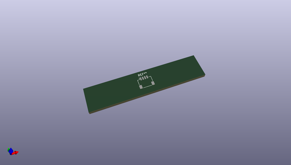
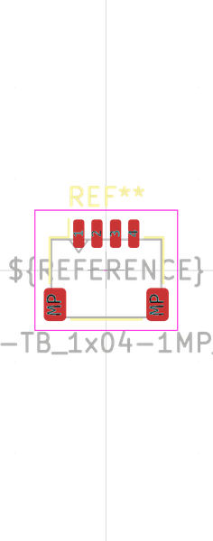

# OOMP Footprint  
## JST_SH_SM05B-SRSS-TB_1x05-1MP_P1.00mm_Horizontal  by oomlout  
  
oomp key: oomp_oomlout_oomlout_oomp_part_footprints_hjsh5psmra_electronic_header_1_mm_jst_sh_5_pin_surface_mount_right_angle  
  
source repo at: [http://github.com/oomlout/oomlout_oomp_part_kicad_footprints/blob/master/tmp/data/oomlout_oomp_footprint_src/oomlout_oomp_part_footprints.pretty/xcr3213mhz8_electronic_ceramic_resonator_3213_3_pin_ground_pin_2_8_mega_hertz_1.kicad_mod](http://github.com/oomlout/oomlout_oomp_part_kicad_footprints/blob/master/tmp/data/oomlout_oomp_footprint_src/oomlout_oomp_part_footprints.pretty/xcr3213mhz8_electronic_ceramic_resonator_3213_3_pin_ground_pin_2_8_mega_hertz_1.kicad_mod)  
## Footprint  
  
  
  
  
| name | value | 
| --- | --- | 
| footprint name | JST_SH_SM05B-SRSS-TB_1x05-1MP_P1.00mm_Horizontal | 
| footprint description | JST SH series connector, SM05B-SRSS-TB (http://www.jst-mfg.com/product/pdf/eng/eSH.pdf), generated with kicad-footprint-generator | 
| number of pads | 7 | 
| github path | http://github.com/oomlout/oomlout_oomp_part_kicad_footprints/blob/master/tmp/data/oomlout_oomp_footprint_src/oomlout_oomp_part_footprints.pretty/hjsh5psmra_electronic_header_1_mm_jst_sh_5_pin_surface_mount_right_angle.kicad_mod | 
| oomp key | oomp_oomlout_oomlout_oomp_part_footprints_hjsh5psmra_electronic_header_1_mm_jst_sh_5_pin_surface_mount_right_angle | 
| oomp bot github | https://github.com/oomlout/oomlout_oomp_footprint_bot/tree/main/tmp/data/oomlout_oomp_footprint_src/footprints/oomlout_oomlout_oomp_part_footprints_hjsh5psmra_electronic_header_1_mm_jst_sh_5_pin_surface_mount_right_angle/working | 
## Images  
