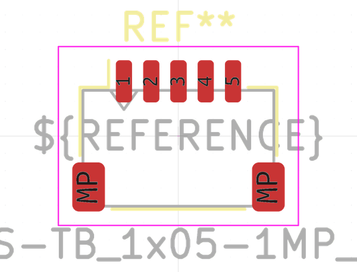

# Electronic Header 1 Mm Jst Sh 5 Pin Surface Mount Right Angle

  
* oomp_key: oomp_electronic_header_1_mm_jst_sh_5_pin_surface_mount_right_angle 
* short_code: h5psmra
* md5_6: af554d  
* github_link: https://github.com/oomlout/oomlout_oomp_part_src/tree/main/parts/electronic_header_1_mm_jst_sh_5_pin_surface_mount_right_angle/working  
## naming details
* classification -- electronic
* type -- header
* size -- 1_mm_jst_sh
* color -- 
* description_main -- 5_pin
* description_extra -- surface_mount_right_angle
* manucaturer -- 
* part_number -- 

## manufacturers
* [JST - SM05B-SRSS-TB](https://www.jst-mfg.com/product/index.php?series=231)  

## symbol

  
oomp_key: oomp_kicad_connector_conn_01x05_pin  
link: https://github.com/oomlout/oomlout_oomp_symbol_bot/tree/main/symbols/kicad_connector_conn_01x05_pin/working  

## footprint

  
oomp_key: oomp_kicad_connector_jst_jst_sh_sm05b_srss_tb_1x05_1mp_p1_00mm_horizontal  
link: https://github.com/oomlout/oomlout_oomp_footprint_bot/tree/main/footprints/kicad_connector_jst_jst_sh_sm05b_srss_tb_1x05_1mp_p1_00mm_horizontal/working  

## full_summary
| name | value | 
| --- | --- | 
| name | value | 
| classification | electronic | 
| type | header | 
| size | 1_mm_jst_sh | 
| color |  | 
| description_main | 5_pin | 
| description_extra | surface_mount_right_angle | 
| manufacturer |  | 
| part_number |  | 
| kicad_reference | J | 
| id | electronic_header_1_mm_jst_sh_5_pin_surface_mount_right_angle | 
| oomp_key | oomp_electronic_header_1_mm_jst_sh_5_pin_surface_mount_right_angle | 
| github_link | https://github.com/oomlout/oomlout_oomp_part_src/tree/main/parts/electronic_header_1_mm_jst_sh_5_pin_surface_mount_right_angle/working | 
| directory | parts/electronic_header_1_mm_jst_sh_5_pin_surface_mount_right_angle | 
| name | Electronic Header 1 Mm Jst Sh 5 Pin Surface Mount Right Angle | 
| short_code | h5psmra | 
| short_name | Jst Sh 5 Pin Surface Mount Right Angle Header 1 Mm Pitch | 
| distributors | [] | 
| manufacturers | [{'name': 'JST', 'part_number': 'SM05B-SRSS-TB', 'link': 'https://www.jst-mfg.com/product/index.php?series=231', 'id': 'manufacturer_jst'}] | 
| md5 | af554da37be509b88081a95a39cfeda0 | 
| md5_5 | af554 | 
| md5_6 | af554d | 
| md5_10 | af554da37b | 
| markdown_full | [electronic_header_1_mm_jst_sh_5_pin_surface_mount_right_angle](https://github.com/oomlout/oomlout_oomp_part_src/tree/main/parts/electronic_header_1_mm_jst_sh_5_pin_surface_mount_right_angle/working) [h5psmra](https://github.com/oomlout/oomlout_oomp_part_src/tree/main/parts/electronic_header_1_mm_jst_sh_5_pin_surface_mount_right_angle/working) [Electronic Header 1 Mm Jst Sh 5 Pin Surface Mount Right Angle](https://github.com/oomlout/oomlout_oomp_part_src/tree/main/parts/electronic_header_1_mm_jst_sh_5_pin_surface_mount_right_angle/working)  [JST - SM05B-SRSS-TB](https://www.jst-mfg.com/product/index.php?series=231) [(L)  ](https://www.lcsc.com/search?q=SM05B-SRSS-TB)[(D)  ](https://www.digikey.com/en/products?keywords=SM05B-SRSS-TB)[(M)  ](https://www.mouser.com/Search/Refine?Keyword=SM05B-SRSS-TB)[(N)  ](https://www.newark.com/search?st=SM05B-SRSS-TB)[(SZ)  ](https://so.szlcsc.com/global.html?k=SM05B-SRSS-TB)  | 
| footprint | [{'link': 'https://github.com/oomlout/oomlout_oomp_footprint_bot/tree/main/foootprntss/kicad_connector_jst_jst_sh_sm05b_srss_tb_1x05_1mp_p1_00mm_horizontal', 'oomp_key': 'oomp_kicad_connector_jst_jst_sh_sm05b_srss_tb_1x05_1mp_p1_00mm_horizontal', 'directory': 'oomlout_oomp_footprint_bot/footprints/kicad_connector_jst_jst_sh_sm05b_srss_tb_1x05_1mp_p1_00mm_horizontal//working/working.kicad_mod'}] | 
| symbol | [{'link': 'https://github.com/oomlout/oomlout_oomp_symbol_bot/tree/main/symbols/kicad_connector_conn_01x05_pin', 'oomp_key': 'oomp_kicad_connector_conn_01x05_pin', 'directory': 'oomlout_oomp_symbol_bot/symbols/kicad_connector_conn_01x05_pin//working/working.kicad_sym'}] | 
