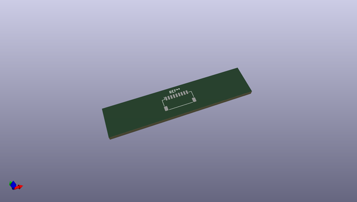
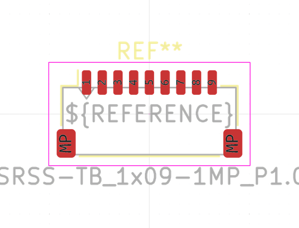

# OOMP Footprint  
## JST_SH_SM09B-SRSS-TB_1x09-1MP_P1.00mm_Horizontal  by none  
  
oomp key: oomp_kicad_connector_jst_jst_sh_sm09b_srss_tb_1x09_1mp_p1_00mm_horizontal  
  
source repo at: [http://gitlab.com/kicad/libraries/kicad-footprints//blob/master/tmp/libraries/kicad-footprints/Varistor.pretty/RV_Rect_V25S440P_L26.5mm_W8.2mm_P12.7mm.kicad_mod](http://gitlab.com/kicad/libraries/kicad-footprints//blob/master/tmp/libraries/kicad-footprints/Varistor.pretty/RV_Rect_V25S440P_L26.5mm_W8.2mm_P12.7mm.kicad_mod)  
## Footprint  
  
  
  
  
| name | value | 
| --- | --- | 
| footprint name | JST_SH_SM09B-SRSS-TB_1x09-1MP_P1.00mm_Horizontal | 
| footprint description | JST SH series connector, SM09B-SRSS-TB (http://www.jst-mfg.com/product/pdf/eng/eSH.pdf), generated with kicad-footprint-generator | 
| number of pads | 11 | 
| github path | http://github.com/kicad/libraries/kicad-footprints//blob/master/tmp/libraries/kicad-footprints/Connector_JST.pretty/JST_SH_SM09B-SRSS-TB_1x09-1MP_P1.00mm_Horizontal.kicad_mod | 
| oomp key | oomp_kicad_connector_jst_jst_sh_sm09b_srss_tb_1x09_1mp_p1_00mm_horizontal | 
| oomp bot github | https://github.com/oomlout/oomlout_oomp_footprint_bot/tree/main/footprints/kicad_connector_jst_jst_sh_sm09b_srss_tb_1x09_1mp_p1_00mm_horizontal/working | 
## Images  
