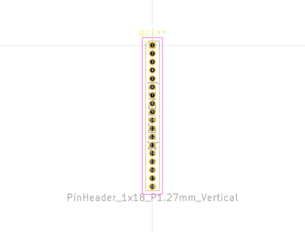

# OOMP Footprint  
## PinHeader_1x18_P1.27mm_Vertical  by none  
  
oomp key: oomp_kicad_connector_pinheader_1_27mm_pinheader_1x18_p1_27mm_vertical  
  
source repo at: [http://gitlab.com/kicad/libraries/kicad-footprints//blob/master/tmp/libraries/kicad-footprints/Varistor.pretty/RV_Rect_V25S440P_L26.5mm_W8.2mm_P12.7mm.kicad_mod](http://gitlab.com/kicad/libraries/kicad-footprints//blob/master/tmp/libraries/kicad-footprints/Varistor.pretty/RV_Rect_V25S440P_L26.5mm_W8.2mm_P12.7mm.kicad_mod)  
## Footprint  
  
  
  
  
| name | value | 
| --- | --- | 
| footprint name | PinHeader_1x18_P1.27mm_Vertical | 
| footprint description | Through hole straight pin header, 1x18, 1.27mm pitch, single row | 
| number of pads | 18 | 
| github path | http://github.com/kicad/libraries/kicad-footprints//blob/master/tmp/libraries/kicad-footprints/Connector_PinHeader_1.27mm.pretty/PinHeader_1x18_P1.27mm_Vertical.kicad_mod | 
| oomp key | oomp_kicad_connector_pinheader_1_27mm_pinheader_1x18_p1_27mm_vertical | 
| oomp bot github | https://github.com/oomlout/oomlout_oomp_footprint_bot/tree/main/footprints/kicad_connector_pinheader_1_27mm_pinheader_1x18_p1_27mm_vertical/working | 
## Images  
