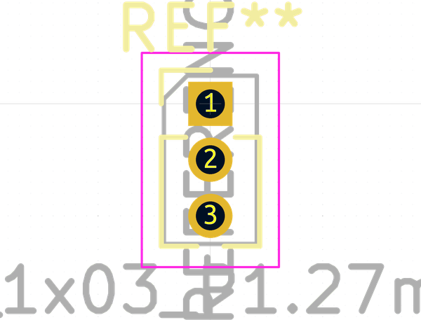

# Electronic Header 1D27 Mm 3 Pin

  
* oomp_key: oomp_electronic_header_1d27_mm_3_pin 
* short_code: h3p
* md5_6: 173b65  
* github_link: https://github.com/oomlout/oomlout_oomp_part_src/tree/main/parts/electronic_header_1d27_mm_3_pin/working  
## naming details
* classification -- electronic
* type -- header
* size -- 1d27_mm
* color -- 
* description_main -- 3_pin
* description_extra -- 
* manucaturer -- 
* part_number -- 

## symbol

  
oomp_key: oomp_kicad_connector_conn_01x03_pin  
link: https://github.com/oomlout/oomlout_oomp_symbol_bot/tree/main/symbols/kicad_connector_conn_01x03_pin/working  

## footprint

  
oomp_key: oomp_kicad_connector_pinheader_1_27mm_pinheader_1x03_p1_27mm_vertical  
link: https://github.com/oomlout/oomlout_oomp_footprint_bot/tree/main/footprints/kicad_connector_pinheader_1_27mm_pinheader_1x03_p1_27mm_vertical/working  

## full_summary
| name | value | 
| --- | --- | 
| name | value | 
| classification | electronic | 
| type | header | 
| size | 1d27_mm | 
| color |  | 
| description_main | 3_pin | 
| description_extra |  | 
| manufacturer |  | 
| part_number |  | 
| kicad_reference | J | 
| id | electronic_header_1d27_mm_3_pin | 
| oomp_key | oomp_electronic_header_1d27_mm_3_pin | 
| github_link | https://github.com/oomlout/oomlout_oomp_part_src/tree/main/parts/electronic_header_1d27_mm_3_pin/working | 
| directory | parts/electronic_header_1d27_mm_3_pin | 
| name | Electronic Header 1D27 Mm 3 Pin | 
| short_code | h3p | 
| distributors | [] | 
| manufacturers | [] | 
| md5 | 173b65fe15927ed18b1237a238ba99f4 | 
| md5_5 | 173b6 | 
| md5_6 | 173b65 | 
| md5_10 | 173b65fe15 | 
| footprint | [{'link': 'https://github.com/oomlout/oomlout_oomp_footprint_bot/tree/main/foootprntss/kicad_connector_pinheader_1_27mm_pinheader_1x03_p1_27mm_vertical', 'oomp_key': 'oomp_kicad_connector_pinheader_1_27mm_pinheader_1x03_p1_27mm_vertical', 'directory': 'oomlout_oomp_footprint_bot/footprints/kicad_connector_pinheader_1_27mm_pinheader_1x03_p1_27mm_vertical//working/working.kicad_mod'}] | 
| symbol | [{'link': 'https://github.com/oomlout/oomlout_oomp_symbol_bot/tree/main/symbols/kicad_connector_conn_01x03_pin', 'oomp_key': 'oomp_kicad_connector_conn_01x03_pin', 'directory': 'oomlout_oomp_symbol_bot/symbols/kicad_connector_conn_01x03_pin//working/working.kicad_sym'}] | 
