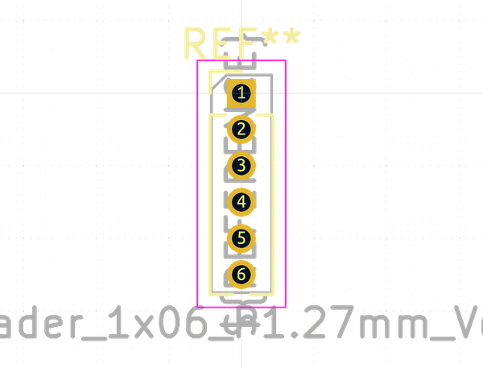

# Electronic Header 1D27 Mm 6 Pin

  
* oomp_key: oomp_electronic_header_1d27_mm_6_pin 
* short_code: h1d276p
* md5_6: 42dbb1  
* github_link: https://github.com/oomlout/oomlout_oomp_part_src/tree/main/parts/electronic_header_1d27_mm_6_pin/working  
## naming details
* classification -- electronic
* type -- header
* size -- 1d27_mm
* color -- 
* description_main -- 6_pin
* description_extra -- 
* manucaturer -- 
* part_number -- 

## distributors
* [LCSC - C2935946](https://lcsc.com/product-detail/C2935946.html)  

## symbol

  
oomp_key: oomp_kicad_connector_conn_01x06_pin  
link: https://github.com/oomlout/oomlout_oomp_symbol_bot/tree/main/symbols/kicad_connector_conn_01x06_pin/working  

## footprint

  
oomp_key: oomp_kicad_connector_pinheader_1_27mm_pinheader_1x06_p1_27mm_vertical  
link: https://github.com/oomlout/oomlout_oomp_footprint_bot/tree/main/footprints/kicad_connector_pinheader_1_27mm_pinheader_1x06_p1_27mm_vertical/working  

## full_summary
| name | value | 
| --- | --- | 
| name | value | 
| classification | electronic | 
| type | header | 
| size | 1d27_mm | 
| color |  | 
| description_main | 6_pin | 
| description_extra |  | 
| manufacturer |  | 
| part_number |  | 
| kicad_reference | J | 
| id | electronic_header_1d27_mm_6_pin | 
| oomp_key | oomp_electronic_header_1d27_mm_6_pin | 
| github_link | https://github.com/oomlout/oomlout_oomp_part_src/tree/main/parts/electronic_header_1d27_mm_6_pin/working | 
| directory | parts/electronic_header_1d27_mm_6_pin | 
| name | Electronic Header 1D27 Mm 6 Pin | 
| short_code | h1d276p | 
| distributors | [{'name': 'LCSC', 'part_number': 'C2935946', 'link': 'https://lcsc.com/product-detail/C2935946.html', 'id': 'distributor_lcsc'}] | 
| manufacturers | [] | 
| md5 | 42dbb144071cf801cfc3ff8bfe51bd2c | 
| md5_5 | 42dbb | 
| md5_6 | 42dbb1 | 
| md5_10 | 42dbb14407 | 
| markdown_full | [electronic_header_1d27_mm_6_pin](https://github.com/oomlout/oomlout_oomp_part_src/tree/main/parts/electronic_header_1d27_mm_6_pin/working) [h1d276p](https://github.com/oomlout/oomlout_oomp_part_src/tree/main/parts/electronic_header_1d27_mm_6_pin/working) [LCSC - C2935946 ](https://lcsc.com/product-detail/C2935946.html)  | 
| footprint | [{'link': 'https://github.com/oomlout/oomlout_oomp_footprint_bot/tree/main/foootprntss/kicad_connector_pinheader_1_27mm_pinheader_1x06_p1_27mm_vertical', 'oomp_key': 'oomp_kicad_connector_pinheader_1_27mm_pinheader_1x06_p1_27mm_vertical', 'directory': 'oomlout_oomp_footprint_bot/footprints/kicad_connector_pinheader_1_27mm_pinheader_1x06_p1_27mm_vertical//working/working.kicad_mod'}] | 
| symbol | [{'link': 'https://github.com/oomlout/oomlout_oomp_symbol_bot/tree/main/symbols/kicad_connector_conn_01x06_pin', 'oomp_key': 'oomp_kicad_connector_conn_01x06_pin', 'directory': 'oomlout_oomp_symbol_bot/symbols/kicad_connector_conn_01x06_pin//working/working.kicad_sym'}] | 
