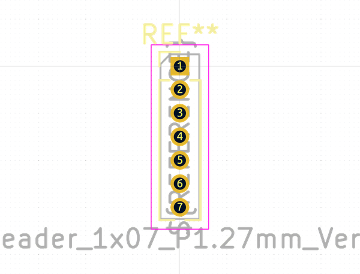

# Electronic Header 1D27 Mm 7 Pin

  
* oomp_key: oomp_electronic_header_1d27_mm_7_pin 
* short_code: h1d277p
* md5_6: 469ff7  
* github_link: https://github.com/oomlout/oomlout_oomp_part_src/tree/main/parts/electronic_header_1d27_mm_7_pin/working  
## naming details
* classification -- electronic
* type -- header
* size -- 1d27_mm
* color -- 
* description_main -- 7_pin
* description_extra -- 
* manucaturer -- 
* part_number -- 

## symbol

  
oomp_key: oomp_kicad_connector_conn_01x07_pin  
link: https://github.com/oomlout/oomlout_oomp_symbol_bot/tree/main/symbols/kicad_connector_conn_01x07_pin/working  

## footprint

  
oomp_key: oomp_kicad_connector_pinheader_1_27mm_pinheader_1x07_p1_27mm_vertical  
link: https://github.com/oomlout/oomlout_oomp_footprint_bot/tree/main/footprints/kicad_connector_pinheader_1_27mm_pinheader_1x07_p1_27mm_vertical/working  

## full_summary
| name | value | 
| --- | --- | 
| name | value | 
| classification | electronic | 
| type | header | 
| size | 1d27_mm | 
| color |  | 
| description_main | 7_pin | 
| description_extra |  | 
| manufacturer |  | 
| part_number |  | 
| kicad_reference | J | 
| id | electronic_header_1d27_mm_7_pin | 
| id_no_class | header_1d27_mm_7_pin | 
| id_no_type | 1d27_mm_7_pin | 
| oomp_key | oomp_electronic_header_1d27_mm_7_pin | 
| github_link | https://github.com/oomlout/oomlout_oomp_part_src/tree/main/parts/electronic_header_1d27_mm_7_pin/working | 
| directory | parts/electronic_header_1d27_mm_7_pin | 
| name | Electronic Header 1D27 Mm 7 Pin | 
| short_code | h1d277p | 
| short_code_upper | H1D277P | 
| distributors | [] | 
| manufacturers | [] | 
| md5 | 469ff7c3bbfe9dfc71b9600db7b20430 | 
| md5_5 | 469ff | 
| md5_6 | 469ff7 | 
| md5_10 | 469ff7c3bb | 
| markdown_full | [electronic_header_1d27_mm_7_pin](https://github.com/oomlout/oomlout_oomp_part_src/tree/main/parts/electronic_header_1d27_mm_7_pin/working) [h1d277p](https://github.com/oomlout/oomlout_oomp_part_src/tree/main/parts/electronic_header_1d27_mm_7_pin/working) [Electronic Header 1D27 Mm 7 Pin](https://github.com/oomlout/oomlout_oomp_part_src/tree/main/parts/electronic_header_1d27_mm_7_pin/working)   | 
| markdown_short | [electronic_header_1d27_mm_7_pin](https://github.com/oomlout/oomlout_oomp_part_src/tree/main/parts/electronic_header_1d27_mm_7_pin/working)   | 
| footprint | [{'link': 'https://github.com/oomlout/oomlout_oomp_footprint_bot/tree/main/foootprntss/kicad_connector_pinheader_1_27mm_pinheader_1x07_p1_27mm_vertical', 'oomp_key': 'oomp_kicad_connector_pinheader_1_27mm_pinheader_1x07_p1_27mm_vertical', 'directory': 'oomlout_oomp_footprint_bot/footprints/kicad_connector_pinheader_1_27mm_pinheader_1x07_p1_27mm_vertical//working/working.kicad_mod'}] | 
| symbol | [{'link': 'https://github.com/oomlout/oomlout_oomp_symbol_bot/tree/main/symbols/kicad_connector_conn_01x07_pin', 'oomp_key': 'oomp_kicad_connector_conn_01x07_pin', 'directory': 'oomlout_oomp_symbol_bot/symbols/kicad_connector_conn_01x07_pin//working/working.kicad_sym'}] | 
