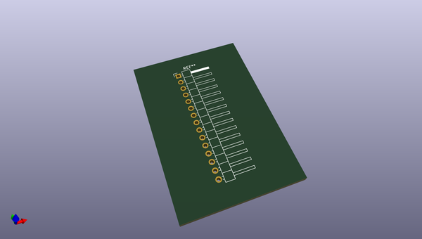
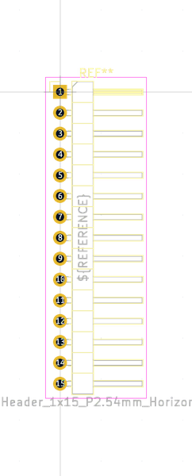
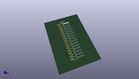
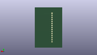
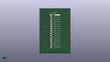

# OOMP Footprint  
## Harwin_M20-89015xx_1x15_P2.54mm_Horizontal  by oomlout  
  
oomp key: oomp_oomlout_oomlout_oomp_part_footprints_hi115psmra_electronic_header_2_54_mm_15_pin_surface_mount_right_angle  
  
source repo at: [http://github.com/oomlout/oomlout_oomp_part_kicad_footprints/blob/master/tmp/data/oomlout_oomp_footprint_src/oomlout_oomp_part_footprints.pretty/xcr3213mhz8_electronic_ceramic_resonator_3213_3_pin_ground_pin_2_8_mega_hertz_1.kicad_mod](http://github.com/oomlout/oomlout_oomp_part_kicad_footprints/blob/master/tmp/data/oomlout_oomp_footprint_src/oomlout_oomp_part_footprints.pretty/xcr3213mhz8_electronic_ceramic_resonator_3213_3_pin_ground_pin_2_8_mega_hertz_1.kicad_mod)  
## Footprint  
  
  
  
  
| name | value | 
| --- | --- | 
| footprint name | Harwin_M20-89015xx_1x15_P2.54mm_Horizontal | 
| footprint description | Harwin Male Horizontal Surface Mount Single Row 2.54mm (0.1 inch) Pitch PCB Connector, M20-89015xx, 15 Pins per row (https://cdn.harwin.com/pdfs/M20-890.pdf), generated with kicad-footprint-generator | 
| number of pads | 16 | 
| github path | http://github.com/oomlout/oomlout_oomp_part_kicad_footprints/blob/master/tmp/data/oomlout_oomp_footprint_src/oomlout_oomp_part_footprints.pretty/hi115psmra_electronic_header_2_54_mm_15_pin_surface_mount_right_angle.kicad_mod | 
| oomp key | oomp_oomlout_oomlout_oomp_part_footprints_hi115psmra_electronic_header_2_54_mm_15_pin_surface_mount_right_angle | 
| oomp bot github | https://github.com/oomlout/oomlout_oomp_footprint_bot/tree/main/tmp/data/oomlout_oomp_footprint_src/footprints/oomlout_oomlout_oomp_part_footprints_hi115psmra_electronic_header_2_54_mm_15_pin_surface_mount_right_angle/working | 
## Images  
  
  
  
  
  
  
  
  
