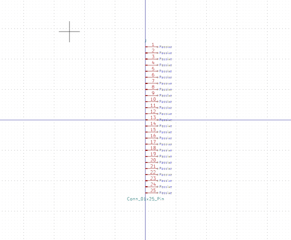

# Electronic Header 2 54 Mm 25 Pin Surface Mount Right Angle

  
* oomp_key: oomp_electronic_header_2_54_mm_25_pin_surface_mount_right_angle 
* short_code: hi125psmra
* md5_6: f88f7f  
* github_link: https://github.com/oomlout/oomlout_oomp_part_src/tree/main/parts/electronic_header_2_54_mm_25_pin_surface_mount_right_angle/working  
## naming details
* classification -- electronic
* type -- header
* size -- 2_54_mm
* color -- 
* description_main -- 25_pin
* description_extra -- surface_mount_right_angle
* manucaturer -- 
* part_number -- 

## symbol

  
oomp_key: oomp_kicad_connector_conn_01x25_pin  
link: https://github.com/oomlout/oomlout_oomp_symbol_bot/tree/main/symbols/kicad_connector_conn_01x25_pin/working  

## full_summary
| name | value | 
| --- | --- | 
| name | value | 
| classification | electronic | 
| type | header | 
| size | 2_54_mm | 
| color |  | 
| description_main | 25_pin | 
| description_extra | surface_mount_right_angle | 
| manufacturer |  | 
| part_number |  | 
| kicad_reference | J | 
| id | electronic_header_2_54_mm_25_pin_surface_mount_right_angle | 
| id_no_class | header_2_54_mm_25_pin_surface_mount_right_angle | 
| id_no_type | 2_54_mm_25_pin_surface_mount_right_angle | 
| oomp_key | oomp_electronic_header_2_54_mm_25_pin_surface_mount_right_angle | 
| github_link | https://github.com/oomlout/oomlout_oomp_part_src/tree/main/parts/electronic_header_2_54_mm_25_pin_surface_mount_right_angle/working | 
| directory | parts/electronic_header_2_54_mm_25_pin_surface_mount_right_angle | 
| name | Electronic Header 2 54 Mm 25 Pin Surface Mount Right Angle | 
| short_code | hi125psmra | 
| short_code_upper | HI125PSMRA | 
| distributors | [] | 
| manufacturers | [] | 
| md5 | f88f7f637c72ee28a1247908c402bf79 | 
| md5_5 | f88f7 | 
| md5_5_upper | F88F7 | 
| md5_6 | f88f7f | 
| md5_6_upper | F88F7F | 
| md5_10 | f88f7f637c | 
| md5_10_upper | F88F7F637C | 
| type_first_letter | h | 
| type_first_letter_upper | H | 
| size_only_numbers | 254 | 
| size_only_numbers_no_zeros | 254 | 
| color_upper |  | 
| color_first_letter |  | 
| color_first_letter_upper |  | 
| description_only_numbers | 25 | 
| description_only_numbers_short | 25 | 
| description_or_color | 25 | 
| description_or_color_upper | 25 | 
| markdown_full | [electronic_header_2_54_mm_25_pin_surface_mount_right_angle](https://github.com/oomlout/oomlout_oomp_part_src/tree/main/parts/electronic_header_2_54_mm_25_pin_surface_mount_right_angle/working) [hi125psmra](https://github.com/oomlout/oomlout_oomp_part_src/tree/main/parts/electronic_header_2_54_mm_25_pin_surface_mount_right_angle/working) [Electronic Header 2 54 Mm 25 Pin Surface Mount Right Angle](https://github.com/oomlout/oomlout_oomp_part_src/tree/main/parts/electronic_header_2_54_mm_25_pin_surface_mount_right_angle/working)   | 
| markdown_short | [electronic_header_2_54_mm_25_pin_surface_mount_right_angle](https://github.com/oomlout/oomlout_oomp_part_src/tree/main/parts/electronic_header_2_54_mm_25_pin_surface_mount_right_angle/working)   | 
| symbol | [{'link': 'https://github.com/oomlout/oomlout_oomp_symbol_bot/tree/main/symbols/kicad_connector_conn_01x25_pin', 'oomp_key': 'oomp_kicad_connector_conn_01x25_pin', 'directory': 'oomlout_oomp_symbol_bot/symbols/kicad_connector_conn_01x25_pin//working/working.kicad_sym'}] | 
