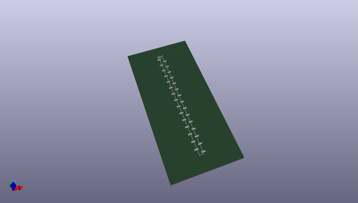
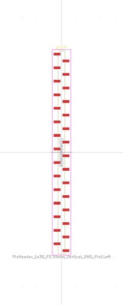
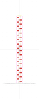
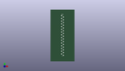

# OOMP Footprint  
## PinHeader_1x30_P2.54mm_Vertical_SMD_Pin1Left  by oomlout  
  
oomp key: oomp_oomlout_oomlout_oomp_part_footprints_hi130psm_electronic_header_2_54_mm_30_pin_surface_mount  
  
source repo at: [http://github.com/oomlout/oomlout_oomp_part_kicad_footprints/blob/master/tmp/data/oomlout_oomp_footprint_src/oomlout_oomp_part_footprints.pretty/xcr3213mhz8_electronic_ceramic_resonator_3213_3_pin_ground_pin_2_8_mega_hertz_1.kicad_mod](http://github.com/oomlout/oomlout_oomp_part_kicad_footprints/blob/master/tmp/data/oomlout_oomp_footprint_src/oomlout_oomp_part_footprints.pretty/xcr3213mhz8_electronic_ceramic_resonator_3213_3_pin_ground_pin_2_8_mega_hertz_1.kicad_mod)  
## Footprint  
  
  
  
  
| name | value | 
| --- | --- | 
| footprint name | PinHeader_1x30_P2.54mm_Vertical_SMD_Pin1Left | 
| footprint description | surface-mounted straight pin header, 1x30, 2.54mm pitch, single row, style 1 (pin 1 left) | 
| number of pads | 30 | 
| github path | http://github.com/oomlout/oomlout_oomp_part_kicad_footprints/blob/master/tmp/data/oomlout_oomp_footprint_src/oomlout_oomp_part_footprints.pretty/hi130psm_electronic_header_2_54_mm_30_pin_surface_mount.kicad_mod | 
| oomp key | oomp_oomlout_oomlout_oomp_part_footprints_hi130psm_electronic_header_2_54_mm_30_pin_surface_mount | 
| oomp bot github | https://github.com/oomlout/oomlout_oomp_footprint_bot/tree/main/tmp/data/oomlout_oomp_footprint_src/footprints/oomlout_oomlout_oomp_part_footprints_hi130psm_electronic_header_2_54_mm_30_pin_surface_mount/working | 
## Images  
  
  
  
  
  
  
  
  
