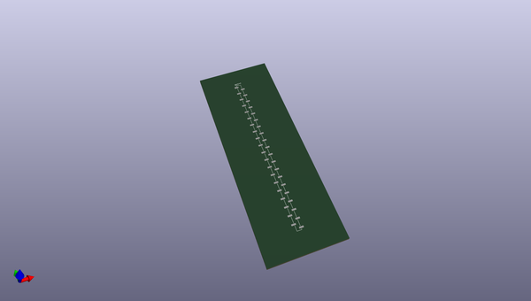
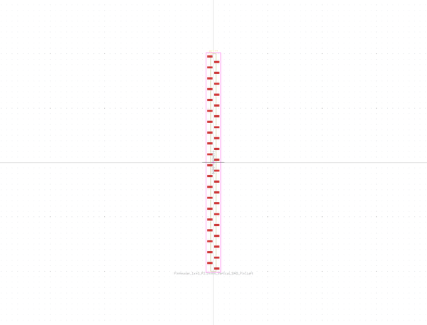
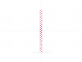
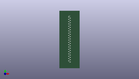

# OOMP Footprint  
## PinHeader_1x40_P2.54mm_Vertical_SMD_Pin1Left  by none  
  
oomp key: oomp_kicad_connector_pinheader_2_54mm_pinheader_1x40_p2_54mm_vertical_smd_pin1left  
  
source repo at: [http://gitlab.com/kicad/kicad-footprints/blob/master/tmp/data//oomlout_oomp_footprint_src/Varistor.pretty/RV_Rect_V25S440P_L26.5mm_W8.2mm_P12.7mm.kicad_mod](http://gitlab.com/kicad/kicad-footprints/blob/master/tmp/data//oomlout_oomp_footprint_src/Varistor.pretty/RV_Rect_V25S440P_L26.5mm_W8.2mm_P12.7mm.kicad_mod)  
## Footprint  
  
  
  
  
| name | value | 
| --- | --- | 
| footprint name | PinHeader_1x40_P2.54mm_Vertical_SMD_Pin1Left | 
| footprint description | surface-mounted straight pin header, 1x40, 2.54mm pitch, single row, style 1 (pin 1 left) | 
| number of pads | 40 | 
| github path | http://github.com/kicad/kicad-footprints/blob/master/tmp/data//oomlout_oomp_footprint_src/Connector_PinHeader_2.54mm.pretty/PinHeader_1x40_P2.54mm_Vertical_SMD_Pin1Left.kicad_mod | 
| oomp key | oomp_kicad_connector_pinheader_2_54mm_pinheader_1x40_p2_54mm_vertical_smd_pin1left | 
| oomp bot github | https://github.com/oomlout/oomlout_oomp_footprint_bot/tree/main/tmp/data//oomlout_oomp_footprint_src/footprints/kicad_connector_pinheader_2_54mm_pinheader_1x40_p2_54mm_vertical_smd_pin1left/working | 
## Images  
  
  
  
  
  
  
  
  
