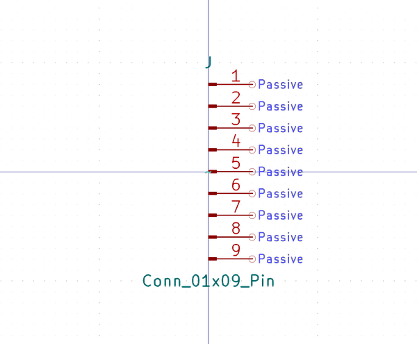

# Electronic Header 2 5 Mm Jst Xh 9 Pin

  
* oomp_key: oomp_electronic_header_2_5_mm_jst_xh_9_pin 
* short_code: h9p
* md5_6: ba4e79  
* github_link: https://github.com/oomlout/oomlout_oomp_part_src/tree/main/parts/electronic_header_2_5_mm_jst_xh_9_pin/working  
## naming details
* classification -- electronic
* type -- header
* size -- 2_5_mm_jst_xh
* color -- 
* description_main -- 9_pin
* description_extra -- 
* manucaturer -- 
* part_number -- 

## symbol

  
oomp_key: oomp_kicad_connector_conn_01x09_pin  
link: https://github.com/oomlout/oomlout_oomp_symbol_bot/tree/main/symbols/kicad_connector_conn_01x09_pin/working  

## full_summary
| name | value | 
| --- | --- | 
| name | value | 
| classification | electronic | 
| type | header | 
| size | 2_5_mm_jst_xh | 
| color |  | 
| description_main | 9_pin | 
| description_extra |  | 
| manufacturer |  | 
| part_number |  | 
| kicad_reference | J | 
| id | electronic_header_2_5_mm_jst_xh_9_pin | 
| id_no_class | header_2_5_mm_jst_xh_9_pin | 
| id_no_type | 2_5_mm_jst_xh_9_pin | 
| oomp_key | oomp_electronic_header_2_5_mm_jst_xh_9_pin | 
| github_link | https://github.com/oomlout/oomlout_oomp_part_src/tree/main/parts/electronic_header_2_5_mm_jst_xh_9_pin/working | 
| directory | parts/electronic_header_2_5_mm_jst_xh_9_pin | 
| name | Electronic Header 2 5 Mm Jst Xh 9 Pin | 
| short_code | h9p | 
| short_code_upper | H9P | 
| distributors | [] | 
| manufacturers | [] | 
| md5 | ba4e79fddd46d7bc5021ae4d4c76e859 | 
| md5_5 | ba4e7 | 
| md5_5_upper | BA4E7 | 
| md5_6 | ba4e79 | 
| md5_6_upper | BA4E79 | 
| md5_10 | ba4e79fddd | 
| md5_10_upper | BA4E79FDDD | 
| type_first_letter | h | 
| type_first_letter_upper | H | 
| size_only_numbers | 25 | 
| size_only_numbers_no_zeros | 25 | 
| color_upper |  | 
| color_first_letter |  | 
| color_first_letter_upper |  | 
| description_only_numbers | 9 | 
| description_only_numbers_short | 9 | 
| description_or_color | 9 | 
| description_or_color_upper | 9 | 
| markdown_full | [electronic_header_2_5_mm_jst_xh_9_pin](https://github.com/oomlout/oomlout_oomp_part_src/tree/main/parts/electronic_header_2_5_mm_jst_xh_9_pin/working) [h9p](https://github.com/oomlout/oomlout_oomp_part_src/tree/main/parts/electronic_header_2_5_mm_jst_xh_9_pin/working) [Electronic Header 2 5 Mm Jst Xh 9 Pin](https://github.com/oomlout/oomlout_oomp_part_src/tree/main/parts/electronic_header_2_5_mm_jst_xh_9_pin/working)   | 
| markdown_short | [electronic_header_2_5_mm_jst_xh_9_pin](https://github.com/oomlout/oomlout_oomp_part_src/tree/main/parts/electronic_header_2_5_mm_jst_xh_9_pin/working)   | 
| symbol | [{'link': 'https://github.com/oomlout/oomlout_oomp_symbol_bot/tree/main/symbols/kicad_connector_conn_01x09_pin', 'oomp_key': 'oomp_kicad_connector_conn_01x09_pin', 'directory': 'oomlout_oomp_symbol_bot/symbols/kicad_connector_conn_01x09_pin//working/working.kicad_sym'}] | 
