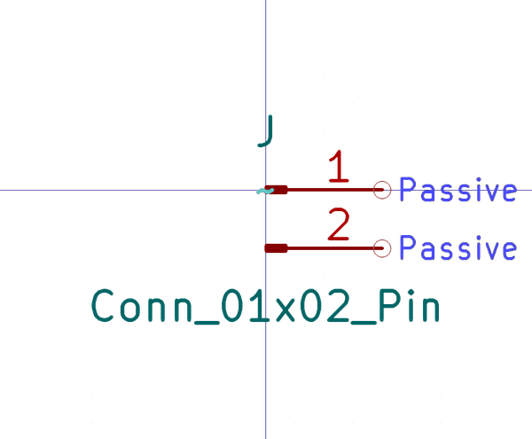

# Electronic Header 2 Mm Jst Ph 2 Pin Surface Mount Right Angle
oomp_key: oomp_electronic_header_2_mm_jst_ph_2_pin_surface_mount_right_angle 

short_code: h2psmra
md5_6: 78e053
github_link: https://github.com/oomlout/oomlout_oomp_part_src/tree/main/parts/electronic_header_2_mm_jst_ph_2_pin_surface_mount_right_angle/working
## naming details
* classification -- electronic
* type -- header
* size -- 2_mm_jst_ph
* color -- 
* description_main -- 2_pin
* description_extra -- surface_mount_right_angle
* manucaturer -- 
* part_number -- 

## symbol

  
oomp_key: oomp_kicad_connector_conn_01x02_pin  
link: https://github.com/oomlout/oomlout_oomp_symbol_bot/tree/main/symbols/kicad_connector_conn_01x02_pin/working  

## full_summary
| name | value | 
| --- | --- | 
| name | value | 
| classification | electronic | 
| type | header | 
| size | 2_mm_jst_ph | 
| color |  | 
| description_main | 2_pin | 
| description_extra | surface_mount_right_angle | 
| manufacturer |  | 
| part_number |  | 
| kicad_reference | J | 
| id | electronic_header_2_mm_jst_ph_2_pin_surface_mount_right_angle | 
| oomp_key | oomp_electronic_header_2_mm_jst_ph_2_pin_surface_mount_right_angle | 
| github_link | https://github.com/oomlout/oomlout_oomp_part_src/tree/main/parts/electronic_header_2_mm_jst_ph_2_pin_surface_mount_right_angle/working | 
| directory | parts/electronic_header_2_mm_jst_ph_2_pin_surface_mount_right_angle | 
| name | Electronic Header 2 Mm Jst Ph 2 Pin Surface Mount Right Angle | 
| short_code | h2psmra | 
| short_name | Jst Ph 2 Pin Surface Mount Right Angle Header 2 Mm Pitch | 
| distributors | [] | 
| manufacturers | [] | 
| md5 | 78e053ceac474be9b0d1da86e45eae46 | 
| md5_5 | 78e05 | 
| md5_6 | 78e053 | 
| md5_10 | 78e053ceac | 
| symbol | [{'link': 'https://github.com/oomlout/oomlout_oomp_symbol_bot/tree/main/symbols/kicad_connector_conn_01x02_pin', 'oomp_key': 'oomp_kicad_connector_conn_01x02_pin', 'directory': 'oomlout_oomp_symbol_bot/symbols/kicad_connector_conn_01x02_pin//working/working.kicad_sym'}] | 
