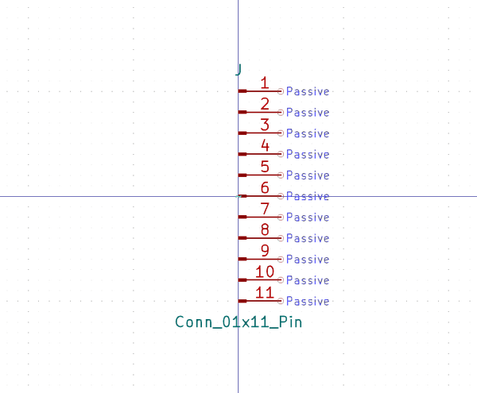
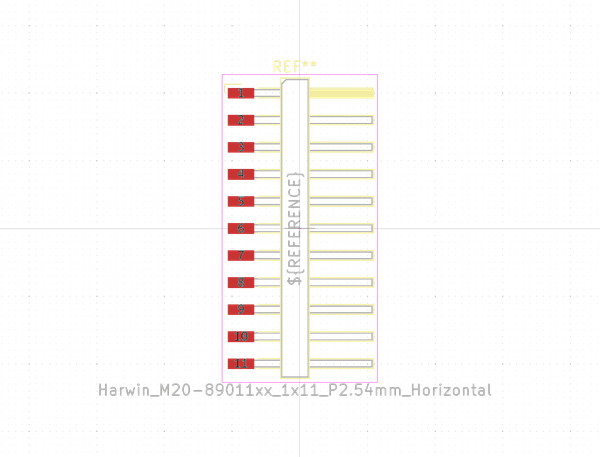

# Electronic Header 2D54 Mm 11 Pin Surface Mount Right Angle
oomp_key: oomp_electronic_header_2d54_mm_11_pin_surface_mount_right_angle  

short_code: hi111psmra
## naming details
* classification -- electronic
* type -- header
* size -- 2d54_mm
* color -- 
* description_main -- 11_pin
* description_extra -- surface_mount_right_angle
* manucaturer -- 
* part_number -- 
## pinout
  
List of Pins:

## symbol

  
oomp_key: oomp_kicad_connector_conn_01x11_pin  
link: https://github.com/oomlout/oomlout_oomp_symbol_bot/tree/main/symbols/kicad_connector_conn_01x11_pin/working  

## footprint

  
oomp_key: oomp_kicad_connector_pinheader_2_54mm_pinheader_1x11_p2_54mm_vertical  
link: https://github.com/oomlout/oomlout_oomp_footprint_bot/tree/main/foootprntss/kicad_connector_pinheader_2_54mm_pinheader_1x11_p2_54mm_vertical/working  

  
oomp_key: oomp_kicad_connector_harwin_harwin_m20_89011xx_1x11_p2_54mm_horizontal  
link: https://github.com/oomlout/oomlout_oomp_footprint_bot/tree/main/foootprntss/kicad_connector_harwin_harwin_m20_89011xx_1x11_p2_54mm_horizontal/working  
