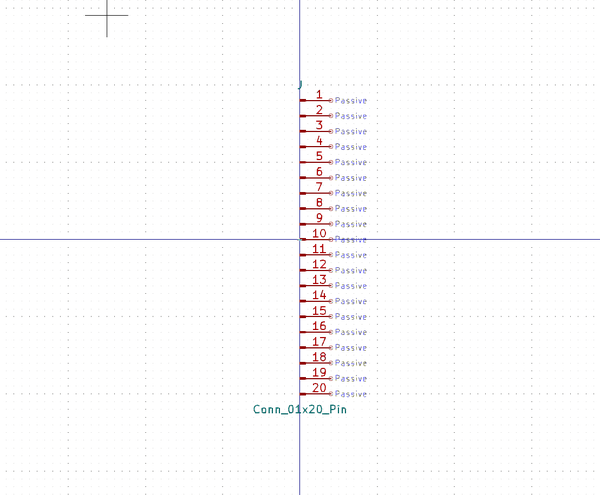

# Electronic Header 2D54 Mm 20 Pin

  
* oomp_key: oomp_electronic_header_2d54_mm_20_pin 
* short_code: hi120p
* md5_6: 1a3631  
* github_link: https://github.com/oomlout/oomlout_oomp_part_src/tree/main/parts/electronic_header_2d54_mm_20_pin/working  
## naming details
* classification -- electronic
* type -- header
* size -- 2d54_mm
* color -- 
* description_main -- 20_pin
* description_extra -- 
* manucaturer -- 
* part_number -- 

## symbol

  
oomp_key: oomp_kicad_connector_conn_01x20_pin  
link: https://github.com/oomlout/oomlout_oomp_symbol_bot/tree/main/symbols/kicad_connector_conn_01x20_pin/working  

## footprint

  
oomp_key: oomp_kicad_connector_pinheader_2_54mm_pinheader_1x20_p2_54mm_vertical  
link: https://github.com/oomlout/oomlout_oomp_footprint_bot/tree/main/footprints/kicad_connector_pinheader_2_54mm_pinheader_1x20_p2_54mm_vertical/working  

## full_summary
| name | value | 
| --- | --- | 
| name | value | 
| classification | electronic | 
| type | header | 
| size | 2d54_mm | 
| color |  | 
| description_main | 20_pin | 
| description_extra |  | 
| manufacturer |  | 
| part_number |  | 
| kicad_reference | J | 
| id | electronic_header_2d54_mm_20_pin | 
| oomp_key | oomp_electronic_header_2d54_mm_20_pin | 
| github_link | https://github.com/oomlout/oomlout_oomp_part_src/tree/main/parts/electronic_header_2d54_mm_20_pin/working | 
| directory | parts/electronic_header_2d54_mm_20_pin | 
| name | Electronic Header 2D54 Mm 20 Pin | 
| short_code | hi120p | 
| short_name | 0.1" 20 Pin Header | 
| distributors | [] | 
| manufacturers | [] | 
| md5 | 1a3631e2adaadb1b2bd8e91f87dc9d53 | 
| md5_5 | 1a363 | 
| md5_6 | 1a3631 | 
| md5_10 | 1a3631e2ad | 
| markdown_full | [electronic_header_2d54_mm_20_pin](https://github.com/oomlout/oomlout_oomp_part_src/tree/main/parts/electronic_header_2d54_mm_20_pin/working) [hi120p](https://github.com/oomlout/oomlout_oomp_part_src/tree/main/parts/electronic_header_2d54_mm_20_pin/working)  | 
| footprint | [{'link': 'https://github.com/oomlout/oomlout_oomp_footprint_bot/tree/main/foootprntss/kicad_connector_pinheader_2_54mm_pinheader_1x20_p2_54mm_vertical', 'oomp_key': 'oomp_kicad_connector_pinheader_2_54mm_pinheader_1x20_p2_54mm_vertical', 'directory': 'oomlout_oomp_footprint_bot/footprints/kicad_connector_pinheader_2_54mm_pinheader_1x20_p2_54mm_vertical//working/working.kicad_mod'}] | 
| symbol | [{'link': 'https://github.com/oomlout/oomlout_oomp_symbol_bot/tree/main/symbols/kicad_connector_conn_01x20_pin', 'oomp_key': 'oomp_kicad_connector_conn_01x20_pin', 'directory': 'oomlout_oomp_symbol_bot/symbols/kicad_connector_conn_01x20_pin//working/working.kicad_sym'}] | 
