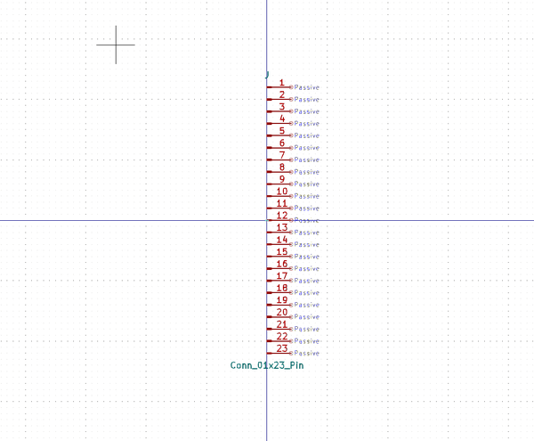

# Electronic Header 2D54 Mm 23 Pin Surface Mount
oomp_key: oomp_electronic_header_2d54_mm_23_pin_surface_mount  

short_code: hi123psm
## naming details
* classification -- electronic
* type -- header
* size -- 2d54_mm
* color -- 
* description_main -- 23_pin
* description_extra -- surface_mount
* manucaturer -- 
* part_number -- 
## pinout
  
List of Pins:

## symbol

  
oomp_key: oomp_kicad_connector_conn_01x23_pin  
link: https://github.com/oomlout/oomlout_oomp_symbol_bot/tree/main/symbols/kicad_connector_conn_01x23_pin/working  

## footprint

  
oomp_key: oomp_kicad_connector_pinheader_2_54mm_pinheader_1x23_p2_54mm_vertical  
link: https://github.com/oomlout/oomlout_oomp_footprint_bot/tree/main/foootprntss/kicad_connector_pinheader_2_54mm_pinheader_1x23_p2_54mm_vertical/working  

  
oomp_key: oomp_kicad_connector_pinheader_2_54mm_pinheader_1x23_p2_54mm_vertical_smd_pin1left  
link: https://github.com/oomlout/oomlout_oomp_footprint_bot/tree/main/foootprntss/kicad_connector_pinheader_2_54mm_pinheader_1x23_p2_54mm_vertical_smd_pin1left/working  
