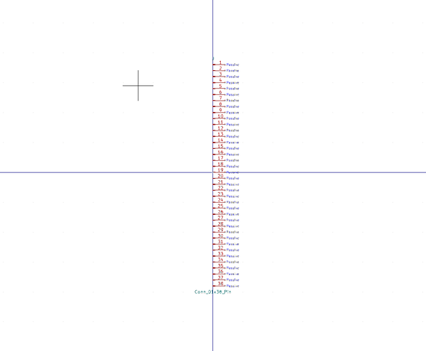

# Electronic Header 2D54 Mm 38 Pin Surface Mount
oomp_key: oomp_electronic_header_2d54_mm_38_pin_surface_mount  

short_code: hi138psm
## naming details
* classification -- electronic
* type -- header
* size -- 2d54_mm
* color -- 
* description_main -- 38_pin
* description_extra -- surface_mount
* manucaturer -- 
* part_number -- 
## pinout

List of Pins:

## symbol

  
oomp_key: oomp_kicad_connector_conn_01x38_pin
link: https://github.com/oomlout/oomlout_oomp_symbol_bot/tree/main/symbols/kicad_connector_conn_01x38_pin

## footprint

  
oomp_key: oomp_kicad_connector_pinheader_2_54mm_pinheader_1x38_p2_54mm_vertical
link: https://github.com/oomlout/oomlout_oomp_footprint_bot/tree/main/foootprntss/kicad_connector_pinheader_2_54mm_pinheader_1x38_p2_54mm_vertical

  
oomp_key: oomp_kicad_connector_pinheader_2_54mm_pinheader_1x38_p2_54mm_vertical_smd_pin1left
link: https://github.com/oomlout/oomlout_oomp_footprint_bot/tree/main/foootprntss/kicad_connector_pinheader_2_54mm_pinheader_1x38_p2_54mm_vertical_smd_pin1left
