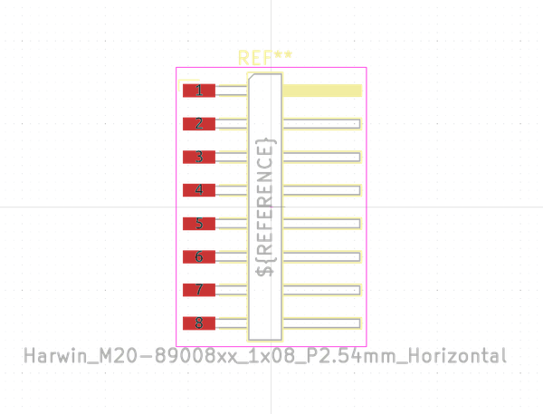

# Electronic Header 2D54 Mm 8 Pin Surface Mount Right Angle

  
* oomp_key: oomp_electronic_header_2d54_mm_8_pin_surface_mount_right_angle 
* short_code: hi18psmra
* md5_6: 9274ec  
* github_link: https://github.com/oomlout/oomlout_oomp_part_src/tree/main/parts/electronic_header_2d54_mm_8_pin_surface_mount_right_angle/working  
## naming details
* classification -- electronic
* type -- header
* size -- 2d54_mm
* color -- 
* description_main -- 8_pin
* description_extra -- surface_mount_right_angle
* manucaturer -- 
* part_number -- 

## symbol

  
oomp_key: oomp_kicad_connector_conn_01x08_pin  
link: https://github.com/oomlout/oomlout_oomp_symbol_bot/tree/main/symbols/kicad_connector_conn_01x08_pin/working  

## footprint

  
oomp_key: oomp_kicad_connector_pinheader_2_54mm_pinheader_1x08_p2_54mm_vertical  
link: https://github.com/oomlout/oomlout_oomp_footprint_bot/tree/main/footprints/kicad_connector_pinheader_2_54mm_pinheader_1x08_p2_54mm_vertical/working  

  
oomp_key: oomp_kicad_connector_harwin_harwin_m20_89008xx_1x08_p2_54mm_horizontal  
link: https://github.com/oomlout/oomlout_oomp_footprint_bot/tree/main/footprints/kicad_connector_harwin_harwin_m20_89008xx_1x08_p2_54mm_horizontal/working  

## full_summary
| name | value | 
| --- | --- | 
| name | value | 
| classification | electronic | 
| type | header | 
| size | 2d54_mm | 
| color |  | 
| description_main | 8_pin | 
| description_extra | surface_mount_right_angle | 
| manufacturer |  | 
| part_number |  | 
| kicad_reference | J | 
| id | electronic_header_2d54_mm_8_pin_surface_mount_right_angle | 
| id_no_class | header_2d54_mm_8_pin_surface_mount_right_angle | 
| id_no_type | 2d54_mm_8_pin_surface_mount_right_angle | 
| oomp_key | oomp_electronic_header_2d54_mm_8_pin_surface_mount_right_angle | 
| github_link | https://github.com/oomlout/oomlout_oomp_part_src/tree/main/parts/electronic_header_2d54_mm_8_pin_surface_mount_right_angle/working | 
| directory | parts/electronic_header_2d54_mm_8_pin_surface_mount_right_angle | 
| name | Electronic Header 2D54 Mm 8 Pin Surface Mount Right Angle | 
| short_code | hi18psmra | 
| short_code_upper | HI18PSMRA | 
| short_name | 0.1" 8 Pin Surface Mount Right Angle Header | 
| distributors | [] | 
| manufacturers | [] | 
| md5 | 9274ec9042dafbe737b964a6240ed1b5 | 
| md5_5 | 9274e | 
| md5_6 | 9274ec | 
| md5_10 | 9274ec9042 | 
| markdown_full | [electronic_header_2d54_mm_8_pin_surface_mount_right_angle](https://github.com/oomlout/oomlout_oomp_part_src/tree/main/parts/electronic_header_2d54_mm_8_pin_surface_mount_right_angle/working) [hi18psmra](https://github.com/oomlout/oomlout_oomp_part_src/tree/main/parts/electronic_header_2d54_mm_8_pin_surface_mount_right_angle/working) [Electronic Header 2D54 Mm 8 Pin Surface Mount Right Angle](https://github.com/oomlout/oomlout_oomp_part_src/tree/main/parts/electronic_header_2d54_mm_8_pin_surface_mount_right_angle/working)   | 
| markdown_short | [electronic_header_2d54_mm_8_pin_surface_mount_right_angle](https://github.com/oomlout/oomlout_oomp_part_src/tree/main/parts/electronic_header_2d54_mm_8_pin_surface_mount_right_angle/working)   | 
| footprint | [{'link': 'https://github.com/oomlout/oomlout_oomp_footprint_bot/tree/main/foootprntss/kicad_connector_pinheader_2_54mm_pinheader_1x08_p2_54mm_vertical', 'oomp_key': 'oomp_kicad_connector_pinheader_2_54mm_pinheader_1x08_p2_54mm_vertical', 'directory': 'oomlout_oomp_footprint_bot/footprints/kicad_connector_pinheader_2_54mm_pinheader_1x08_p2_54mm_vertical//working/working.kicad_mod'}, {'link': 'https://github.com/oomlout/oomlout_oomp_footprint_bot/tree/main/foootprntss/kicad_connector_harwin_harwin_m20_89008xx_1x08_p2_54mm_horizontal', 'oomp_key': 'oomp_kicad_connector_harwin_harwin_m20_89008xx_1x08_p2_54mm_horizontal', 'directory': 'oomlout_oomp_footprint_bot/footprints/kicad_connector_harwin_harwin_m20_89008xx_1x08_p2_54mm_horizontal//working/working.kicad_mod'}] | 
| symbol | [{'link': 'https://github.com/oomlout/oomlout_oomp_symbol_bot/tree/main/symbols/kicad_connector_conn_01x08_pin', 'oomp_key': 'oomp_kicad_connector_conn_01x08_pin', 'directory': 'oomlout_oomp_symbol_bot/symbols/kicad_connector_conn_01x08_pin//working/working.kicad_sym'}] | 
