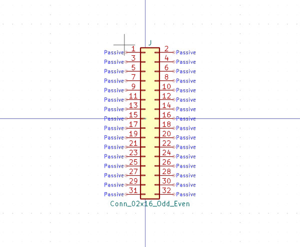

# Electronic Header 2D54 Mm Dual Row 2X16 Dual Row 32 Pin

  
* oomp_key: oomp_electronic_header_2d54_mm_dual_row_2x16_dual_row_32_pin 
* short_code: hi12x16p
* md5_6: 7a237b  
* github_link: https://github.com/oomlout/oomlout_oomp_part_src/tree/main/parts/electronic_header_2d54_mm_dual_row_2x16_dual_row_32_pin/working  
## naming details
* classification -- electronic
* type -- header
* size -- 2d54_mm_dual_row
* color -- 
* description_main -- 2x16_dual_row_32_pin
* description_extra -- 
* manucaturer -- 
* part_number -- 

## symbol

  
oomp_key: oomp_kicad_connector_generic_conn_02x16_odd_even  
link: https://github.com/oomlout/oomlout_oomp_symbol_bot/tree/main/symbols/kicad_connector_generic_conn_02x16_odd_even/working  

## footprint

  
oomp_key: oomp_kicad_connector_pinheader_2_54mm_pinheader_2x16_p2_54mm_vertical  
link: https://github.com/oomlout/oomlout_oomp_footprint_bot/tree/main/footprints/kicad_connector_pinheader_2_54mm_pinheader_2x16_p2_54mm_vertical/working  

## full_summary
| name | value | 
| --- | --- | 
| name | value | 
| classification | electronic | 
| type | header | 
| size | 2d54_mm_dual_row | 
| color |  | 
| description_main | 2x16_dual_row_32_pin | 
| description_extra |  | 
| manufacturer |  | 
| part_number |  | 
| kicad_reference | J | 
| id | electronic_header_2d54_mm_dual_row_2x16_dual_row_32_pin | 
| id_no_class | header_2d54_mm_dual_row_2x16_dual_row_32_pin | 
| id_no_type | 2d54_mm_dual_row_2x16_dual_row_32_pin | 
| oomp_key | oomp_electronic_header_2d54_mm_dual_row_2x16_dual_row_32_pin | 
| github_link | https://github.com/oomlout/oomlout_oomp_part_src/tree/main/parts/electronic_header_2d54_mm_dual_row_2x16_dual_row_32_pin/working | 
| directory | parts/electronic_header_2d54_mm_dual_row_2x16_dual_row_32_pin | 
| name | Electronic Header 2D54 Mm Dual Row 2X16 Dual Row 32 Pin | 
| short_code | hi12x16p | 
| short_code_upper | HI12X16P | 
| distributors | [] | 
| manufacturers | [] | 
| md5 | 7a237ba6a9a37237c8e25de6ead6c6a0 | 
| md5_5 | 7a237 | 
| md5_5_upper | 7A237 | 
| md5_6 | 7a237b | 
| md5_6_upper | 7A237B | 
| md5_10 | 7a237ba6a9 | 
| md5_10_upper | 7A237BA6A9 | 
| type_first_letter | h | 
| type_first_letter_upper | H | 
| size_only_numbers | 254 | 
| size_only_numbers_no_zeros | 254 | 
| color_upper |  | 
| color_first_letter |  | 
| color_first_letter_upper |  | 
| description_only_numbers | 21632 | 
| description_only_numbers_short | 22k | 
| description_or_color | 22k | 
| description_or_color_upper | 22K | 
| markdown_full | [electronic_header_2d54_mm_dual_row_2x16_dual_row_32_pin](https://github.com/oomlout/oomlout_oomp_part_src/tree/main/parts/electronic_header_2d54_mm_dual_row_2x16_dual_row_32_pin/working) [hi12x16p](https://github.com/oomlout/oomlout_oomp_part_src/tree/main/parts/electronic_header_2d54_mm_dual_row_2x16_dual_row_32_pin/working) [Electronic Header 2D54 Mm Dual Row 2X16 Dual Row 32 Pin](https://github.com/oomlout/oomlout_oomp_part_src/tree/main/parts/electronic_header_2d54_mm_dual_row_2x16_dual_row_32_pin/working)   | 
| markdown_short | [electronic_header_2d54_mm_dual_row_2x16_dual_row_32_pin](https://github.com/oomlout/oomlout_oomp_part_src/tree/main/parts/electronic_header_2d54_mm_dual_row_2x16_dual_row_32_pin/working)   | 
| footprint | [{'link': 'https://github.com/oomlout/oomlout_oomp_footprint_bot/tree/main/foootprntss/kicad_connector_pinheader_2_54mm_pinheader_2x16_p2_54mm_vertical', 'oomp_key': 'oomp_kicad_connector_pinheader_2_54mm_pinheader_2x16_p2_54mm_vertical', 'directory': 'oomlout_oomp_footprint_bot/footprints/kicad_connector_pinheader_2_54mm_pinheader_2x16_p2_54mm_vertical//working/working.kicad_mod'}] | 
| symbol | [{'link': 'https://github.com/oomlout/oomlout_oomp_symbol_bot/tree/main/symbols/kicad_connector_generic_conn_02x16_odd_even', 'oomp_key': 'oomp_kicad_connector_generic_conn_02x16_odd_even', 'directory': 'oomlout_oomp_symbol_bot/symbols/kicad_connector_generic_conn_02x16_odd_even//working/working.kicad_sym'}] | 
