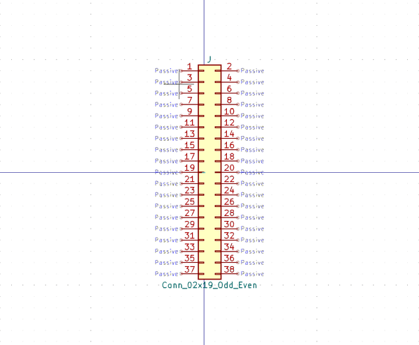

# Electronic Header 2D54 Mm Dual Row 2X19 Dual Row 38 Pin Right Angle

  
* oomp_key: oomp_electronic_header_2d54_mm_dual_row_2x19_dual_row_38_pin_right_angle 
* short_code: hi12x19pra
* md5_6: a6d941  
* github_link: https://github.com/oomlout/oomlout_oomp_part_src/tree/main/parts/electronic_header_2d54_mm_dual_row_2x19_dual_row_38_pin_right_angle/working  
## naming details
* classification -- electronic
* type -- header
* size -- 2d54_mm_dual_row
* color -- 
* description_main -- 2x19_dual_row_38_pin
* description_extra -- right_angle
* manucaturer -- 
* part_number -- 

## distributors
* [LCSC - C2333](https://lcsc.com/product-detail/C2333.html)  
* [LCSC - C213462](https://lcsc.com/product-detail/C213462.html)  
* [LCSC - C3410](https://lcsc.com/product-detail/C3410.html)  

## symbol

  
oomp_key: oomp_kicad_connector_generic_conn_02x19_odd_even  
link: https://github.com/oomlout/oomlout_oomp_symbol_bot/tree/main/symbols/kicad_connector_generic_conn_02x19_odd_even/working  

## full_summary
| name | value | 
| --- | --- | 
| name | value | 
| classification | electronic | 
| type | header | 
| size | 2d54_mm_dual_row | 
| color |  | 
| description_main | 2x19_dual_row_38_pin | 
| description_extra | right_angle | 
| manufacturer |  | 
| part_number |  | 
| kicad_reference | J | 
| id | electronic_header_2d54_mm_dual_row_2x19_dual_row_38_pin_right_angle | 
| id_no_class | header_2d54_mm_dual_row_2x19_dual_row_38_pin_right_angle | 
| id_no_type | 2d54_mm_dual_row_2x19_dual_row_38_pin_right_angle | 
| oomp_key | oomp_electronic_header_2d54_mm_dual_row_2x19_dual_row_38_pin_right_angle | 
| github_link | https://github.com/oomlout/oomlout_oomp_part_src/tree/main/parts/electronic_header_2d54_mm_dual_row_2x19_dual_row_38_pin_right_angle/working | 
| directory | parts/electronic_header_2d54_mm_dual_row_2x19_dual_row_38_pin_right_angle | 
| name | Electronic Header 2D54 Mm Dual Row 2X19 Dual Row 38 Pin Right Angle | 
| short_code | hi12x19pra | 
| short_code_upper | HI12X19PRA | 
| distributors | [{'name': 'LCSC', 'part_number': 'C2333', 'link': 'https://lcsc.com/product-detail/C2333.html', 'id': 'distributor_lcsc'}, {'name': 'LCSC', 'part_number': 'C213462', 'link': 'https://lcsc.com/product-detail/C213462.html', 'id': 'distributor_lcsc'}, {'name': 'LCSC', 'part_number': 'C3410', 'link': 'https://lcsc.com/product-detail/C3410.html', 'id': 'distributor_lcsc'}] | 
| manufacturers | [] | 
| md5 | a6d941685b067c0e970f1cf0255ea216 | 
| md5_5 | a6d94 | 
| md5_5_upper | A6D94 | 
| md5_6 | a6d941 | 
| md5_6_upper | A6D941 | 
| md5_10 | a6d941685b | 
| md5_10_upper | A6D941685B | 
| type_first_letter | h | 
| type_first_letter_upper | H | 
| size_only_numbers | 254 | 
| size_only_numbers_no_zeros | 254 | 
| color_upper |  | 
| color_first_letter |  | 
| color_first_letter_upper |  | 
| description_only_numbers | 21938 | 
| description_only_numbers_short | 22k | 
| description_or_color | 22k | 
| description_or_color_upper | 22K | 
| markdown_full | [electronic_header_2d54_mm_dual_row_2x19_dual_row_38_pin_right_angle](https://github.com/oomlout/oomlout_oomp_part_src/tree/main/parts/electronic_header_2d54_mm_dual_row_2x19_dual_row_38_pin_right_angle/working) [hi12x19pra](https://github.com/oomlout/oomlout_oomp_part_src/tree/main/parts/electronic_header_2d54_mm_dual_row_2x19_dual_row_38_pin_right_angle/working) [Electronic Header 2D54 Mm Dual Row 2X19 Dual Row 38 Pin Right Angle](https://github.com/oomlout/oomlout_oomp_part_src/tree/main/parts/electronic_header_2d54_mm_dual_row_2x19_dual_row_38_pin_right_angle/working) [LCSC - C2333 ](https://lcsc.com/product-detail/C2333.html)[LCSC - C213462 ](https://lcsc.com/product-detail/C213462.html)[LCSC - C3410 ](https://lcsc.com/product-detail/C3410.html)  | 
| markdown_short | [electronic_header_2d54_mm_dual_row_2x19_dual_row_38_pin_right_angle](https://github.com/oomlout/oomlout_oomp_part_src/tree/main/parts/electronic_header_2d54_mm_dual_row_2x19_dual_row_38_pin_right_angle/working) [LCSC - C2333 ](https://lcsc.com/product-detail/C2333.html)[LCSC - C213462 ](https://lcsc.com/product-detail/C213462.html)[LCSC - C3410 ](https://lcsc.com/product-detail/C3410.html)  | 
| symbol | [{'link': 'https://github.com/oomlout/oomlout_oomp_symbol_bot/tree/main/symbols/kicad_connector_generic_conn_02x19_odd_even', 'oomp_key': 'oomp_kicad_connector_generic_conn_02x19_odd_even', 'directory': 'oomlout_oomp_symbol_bot/symbols/kicad_connector_generic_conn_02x19_odd_even//working/working.kicad_sym'}] | 
