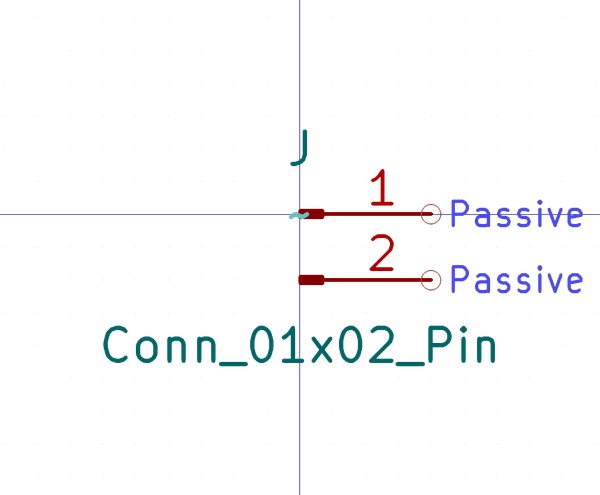

# Electronic Header 2D54 Mm Jst Xh 2 Pin Surface Mount

  
* oomp_key: oomp_electronic_header_2d54_mm_jst_xh_2_pin_surface_mount 
* short_code: h2psm
* md5_6: c599a5  
* github_link: https://github.com/oomlout/oomlout_oomp_part_src/tree/main/parts/electronic_header_2d54_mm_jst_xh_2_pin_surface_mount/working  
## naming details
* classification -- electronic
* type -- header
* size -- 2d54_mm_jst_xh
* color -- 
* description_main -- 2_pin
* description_extra -- surface_mount
* manucaturer -- 
* part_number -- 

## symbol

  
oomp_key: oomp_kicad_connector_conn_01x02_pin  
link: https://github.com/oomlout/oomlout_oomp_symbol_bot/tree/main/symbols/kicad_connector_conn_01x02_pin/working  

## full_summary
| name | value | 
| --- | --- | 
| name | value | 
| classification | electronic | 
| type | header | 
| size | 2d54_mm_jst_xh | 
| color |  | 
| description_main | 2_pin | 
| description_extra | surface_mount | 
| manufacturer |  | 
| part_number |  | 
| kicad_reference | J | 
| id | electronic_header_2d54_mm_jst_xh_2_pin_surface_mount | 
| oomp_key | oomp_electronic_header_2d54_mm_jst_xh_2_pin_surface_mount | 
| github_link | https://github.com/oomlout/oomlout_oomp_part_src/tree/main/parts/electronic_header_2d54_mm_jst_xh_2_pin_surface_mount/working | 
| directory | parts/electronic_header_2d54_mm_jst_xh_2_pin_surface_mount | 
| name | Electronic Header 2D54 Mm Jst Xh 2 Pin Surface Mount | 
| short_code | h2psm | 
| short_name | Jst Xh 2 Pin Surface Mount Header 2.54 Mm Pitch | 
| distributors | [] | 
| manufacturers | [] | 
| md5 | c599a555cc880fa96ce0ebd1f40b76de | 
| md5_5 | c599a | 
| md5_6 | c599a5 | 
| md5_10 | c599a555cc | 
| markdown_full | [electronic_header_2d54_mm_jst_xh_2_pin_surface_mount](https://github.com/oomlout/oomlout_oomp_part_src/tree/main/parts/electronic_header_2d54_mm_jst_xh_2_pin_surface_mount/working) [h2psm](https://github.com/oomlout/oomlout_oomp_part_src/tree/main/parts/electronic_header_2d54_mm_jst_xh_2_pin_surface_mount/working) [Electronic Header 2D54 Mm Jst Xh 2 Pin Surface Mount](https://github.com/oomlout/oomlout_oomp_part_src/tree/main/parts/electronic_header_2d54_mm_jst_xh_2_pin_surface_mount/working)   | 
| markdown_short | [electronic_header_2d54_mm_jst_xh_2_pin_surface_mount](https://github.com/oomlout/oomlout_oomp_part_src/tree/main/parts/electronic_header_2d54_mm_jst_xh_2_pin_surface_mount/working)   | 
| symbol | [{'link': 'https://github.com/oomlout/oomlout_oomp_symbol_bot/tree/main/symbols/kicad_connector_conn_01x02_pin', 'oomp_key': 'oomp_kicad_connector_conn_01x02_pin', 'directory': 'oomlout_oomp_symbol_bot/symbols/kicad_connector_conn_01x02_pin//working/working.kicad_sym'}] | 
