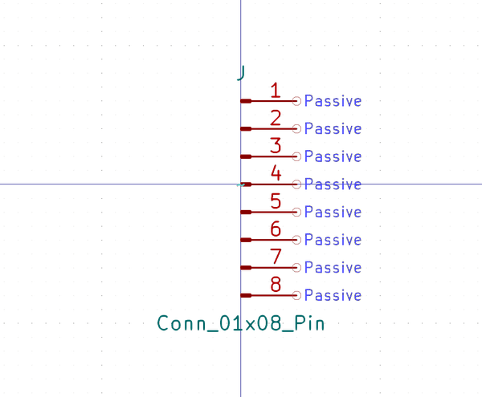

# Electronic Header 2D54 Mm Jst Xh 8 Pin Surface Mount Right Angle

  
* oomp_key: oomp_electronic_header_2d54_mm_jst_xh_8_pin_surface_mount_right_angle 
* short_code: h8psmra
* md5_6: a64bcd  
* github_link: https://github.com/oomlout/oomlout_oomp_part_src/tree/main/parts/electronic_header_2d54_mm_jst_xh_8_pin_surface_mount_right_angle/working  
## naming details
* classification -- electronic
* type -- header
* size -- 2d54_mm_jst_xh
* color -- 
* description_main -- 8_pin
* description_extra -- surface_mount_right_angle
* manucaturer -- 
* part_number -- 

## symbol

  
oomp_key: oomp_kicad_connector_conn_01x08_pin  
link: https://github.com/oomlout/oomlout_oomp_symbol_bot/tree/main/symbols/kicad_connector_conn_01x08_pin/working  

## full_summary
| name | value | 
| --- | --- | 
| name | value | 
| classification | electronic | 
| type | header | 
| size | 2d54_mm_jst_xh | 
| color |  | 
| description_main | 8_pin | 
| description_extra | surface_mount_right_angle | 
| manufacturer |  | 
| part_number |  | 
| kicad_reference | J | 
| id | electronic_header_2d54_mm_jst_xh_8_pin_surface_mount_right_angle | 
| oomp_key | oomp_electronic_header_2d54_mm_jst_xh_8_pin_surface_mount_right_angle | 
| github_link | https://github.com/oomlout/oomlout_oomp_part_src/tree/main/parts/electronic_header_2d54_mm_jst_xh_8_pin_surface_mount_right_angle/working | 
| directory | parts/electronic_header_2d54_mm_jst_xh_8_pin_surface_mount_right_angle | 
| name | Electronic Header 2D54 Mm Jst Xh 8 Pin Surface Mount Right Angle | 
| short_code | h8psmra | 
| short_name | Jst Xh 8 Pin Surface Mount Right Angle Header 2.54 Mm Pitch | 
| distributors | [] | 
| manufacturers | [] | 
| md5 | a64bcd242f65cbaa3af67607ab4b934a | 
| md5_5 | a64bc | 
| md5_6 | a64bcd | 
| md5_10 | a64bcd242f | 
| markdown_full | [electronic_header_2d54_mm_jst_xh_8_pin_surface_mount_right_angle](https://github.com/oomlout/oomlout_oomp_part_src/tree/main/parts/electronic_header_2d54_mm_jst_xh_8_pin_surface_mount_right_angle/working) [h8psmra](https://github.com/oomlout/oomlout_oomp_part_src/tree/main/parts/electronic_header_2d54_mm_jst_xh_8_pin_surface_mount_right_angle/working) [Electronic Header 2D54 Mm Jst Xh 8 Pin Surface Mount Right Angle](https://github.com/oomlout/oomlout_oomp_part_src/tree/main/parts/electronic_header_2d54_mm_jst_xh_8_pin_surface_mount_right_angle/working)   | 
| symbol | [{'link': 'https://github.com/oomlout/oomlout_oomp_symbol_bot/tree/main/symbols/kicad_connector_conn_01x08_pin', 'oomp_key': 'oomp_kicad_connector_conn_01x08_pin', 'directory': 'oomlout_oomp_symbol_bot/symbols/kicad_connector_conn_01x08_pin//working/working.kicad_sym'}] | 
