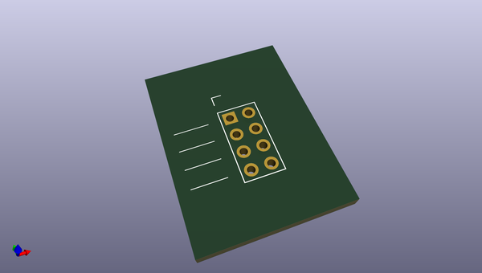
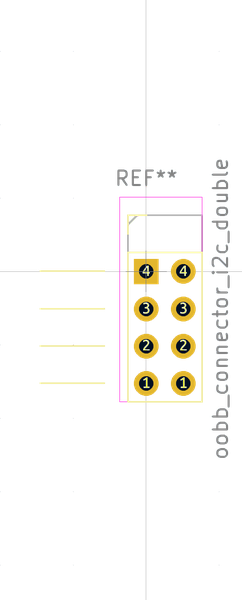

# OOMP Footprint  
## oobb_connector_i2c_double  by oomlout  
  
oomp key: oomp_oomlout_oomlout_oomp_footprint_templates_oobb_connector_i2c_double  
  
source repo at: [http://github.com/oomlout/oomlout_oomp_part_templates/blob/master/tmp/data/oomlout_oomp_footprint_src/oomlout_oomp_footprint_templates.pretty/oobb_connector_i2c_triple.kicad_mod](http://github.com/oomlout/oomlout_oomp_part_templates/blob/master/tmp/data/oomlout_oomp_footprint_src/oomlout_oomp_footprint_templates.pretty/oobb_connector_i2c_triple.kicad_mod)  
## Footprint  
  
  
  
  
| name | value | 
| --- | --- | 
| footprint name | oobb_connector_i2c_double | 
| footprint description | Through hole straight pin header, 1x03, 2.54mm pitch, single row | 
| number of pads | 8 | 
| github path | http://github.com/oomlout/oomlout_oomp_part_templates/blob/master/tmp/data/oomlout_oomp_footprint_src/oomlout_oomp_footprint_templates.pretty/oobb_connector_i2c_double.kicad_mod | 
| oomp key | oomp_oomlout_oomlout_oomp_footprint_templates_oobb_connector_i2c_double | 
| oomp bot github | https://github.com/oomlout/oomlout_oomp_footprint_bot/tree/main/tmp/data/oomlout_oomp_footprint_src/footprints/oomlout_oomlout_oomp_footprint_templates_oobb_connector_i2c_double/working | 
## Images  
